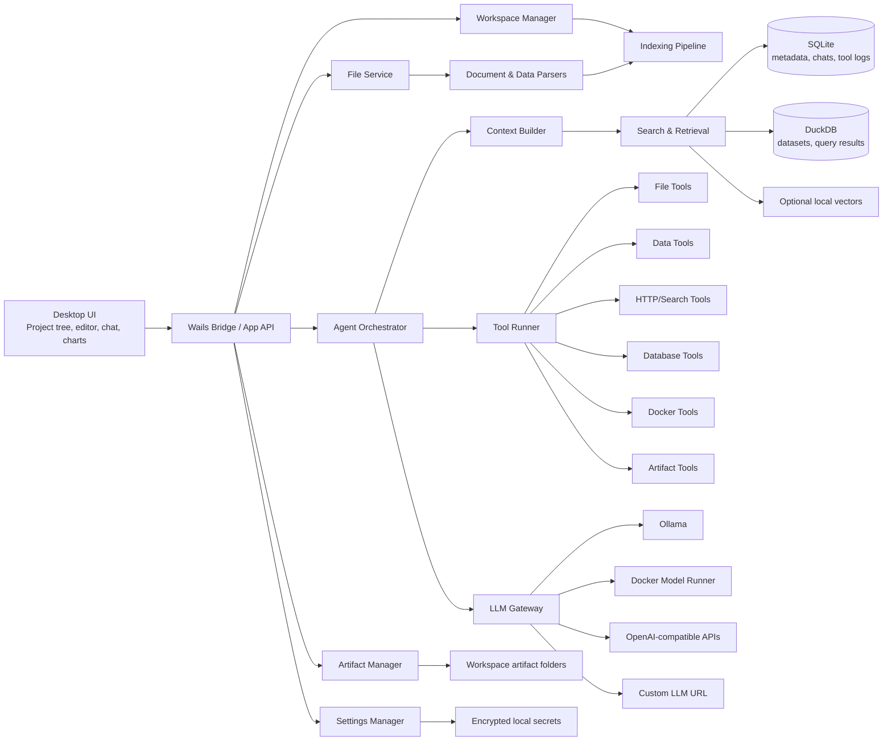

# Architecture

## Architectural Style

NexusDesk should be a modular local-first desktop application with a strong Go backend and a rich web-based frontend.

The recommended first version:

- Wails desktop shell
- Go backend
- React or Svelte frontend
- Monaco editor for code/text
- SQLite for app state
- DuckDB for local analytics
- local file/document parsing services
- configurable LLM gateway
- permissioned tool runner

The architecture should keep clean seams for later:

- MCP client support
- external tool plugins
- team/server mode
- Docker Desktop extension
- managed search or vector backends
- enterprise policy and audit

## High-Level Diagram



## Core Modules

### 1. Desktop Shell

Responsibilities:

- launch the local app
- expose Go backend functions to the frontend
- manage native file dialogs
- support Windows, macOS, and Linux builds
- keep app packaging separate from business logic

The shell should be thin. Most behavior should live in backend modules and frontend components.

### 2. Frontend

Responsibilities:

- project and workspace navigation
- file tree
- tabs and editor state
- code highlighting
- image and PDF preview
- Excel/table preview
- chat UI
- tool call timeline
- approval dialogs
- charts and dashboards
- settings screens
- artifact browser

The frontend should render structured data from the backend. It should not contain business rules for file permissions, database safety, or Docker safety.

### 3. Workspace Manager

Responsibilities:

- register workspaces
- remember recent workspaces
- enforce workspace root boundaries
- track workspace configuration
- track file scan status
- coordinate file watchers
- map generated artifacts back to the workspace

A workspace can be code-focused, data-focused, marketing-focused, operations-focused, or mixed.

### 4. File And Document Services

Responsibilities:

- list directories
- read files within allowed roots
- detect file types
- choose preview mode
- extract text from documents
- inspect images
- parse spreadsheets
- limit file size and output size
- maintain raw/source hashes

File services must never allow path traversal outside the approved workspace roots.

### 5. Indexing Pipeline

Responsibilities:

- classify files
- extract searchable text
- create chunks
- index filenames, paths, metadata, and content
- profile datasets
- track changed files
- schedule document summaries when useful
- store generated summaries separately from source content

Indexing should be incremental and explainable.

### 6. Search And Context Builder

Responsibilities:

- search files, chunks, datasets, schemas, conversations, artifacts, and tool results
- rank candidates by relevance and recency
- build compact context packs for LLM calls
- avoid overloading the model context window
- cite source identifiers in answers

The agent should ask for more context through tools instead of receiving the whole workspace.

### 7. Agent Orchestrator

Responsibilities:

- manage conversation state
- call the LLM gateway
- parse tool requests
- apply tool policies
- request user approvals when needed
- feed tool results back to the model
- stop loops safely
- create final answers and artifacts

The agent owns flow control. The LLM owns language generation and reasoning attempts, not permissions.

### 8. LLM Gateway

Responsibilities:

- support configurable base URLs
- support multiple providers
- normalize request and response formats
- support streaming where available
- expose provider capabilities
- enforce timeouts and token limits
- log latency and errors
- support model profiles

Provider support should start with:

- Ollama native
- OpenAI-compatible
- Docker Model Runner compatible endpoints
- custom HTTP profile

### 9. Tool Runner

Responsibilities:

- implement built-in tools
- validate input
- enforce permissions
- rate-limit expensive calls
- cap output size
- record tool runs
- return structured results

Tools should be deterministic and testable.

### 10. Artifact Manager

Responsibilities:

- create output directories
- write generated files
- track artifact metadata
- render or export charts
- create report files
- link artifacts to chats and tool runs
- prevent silent overwrites

Artifacts are the bridge between chat and real work.

## Deployment Shape

### Local Developer

```text
wails dev
go backend
frontend dev server
sqlite
duckdb
ollama or custom LLM endpoint
```

### Packaged Desktop

```text
NexusDesk app
embedded frontend assets
Go backend in same process
local app database
user-selected model endpoint
```

### Team Or Enterprise Future

```text
desktop client
local file tools
optional team sync service
central policy server
shared model gateway
audit export
connector credential vault
```

### Docker Desktop Extension Future

```text
Docker Desktop UI extension
Go extension backend
Docker Engine API access
NexusDesk agent modules
model runner integration
```

## Key Design Decisions

NexusDesk should not let the LLM directly operate the machine.

The safe pattern is:

```text
LLM requests action
  ↓
Agent parses request
  ↓
Policy engine evaluates risk
  ↓
User approves if needed
  ↓
Tool runner performs action
  ↓
Tool result is logged and returned
```

The LLM should help reason over the workspace, but deterministic Go modules should own IO, permissions, data parsing, indexing, queries, Docker access, and artifact writes.
