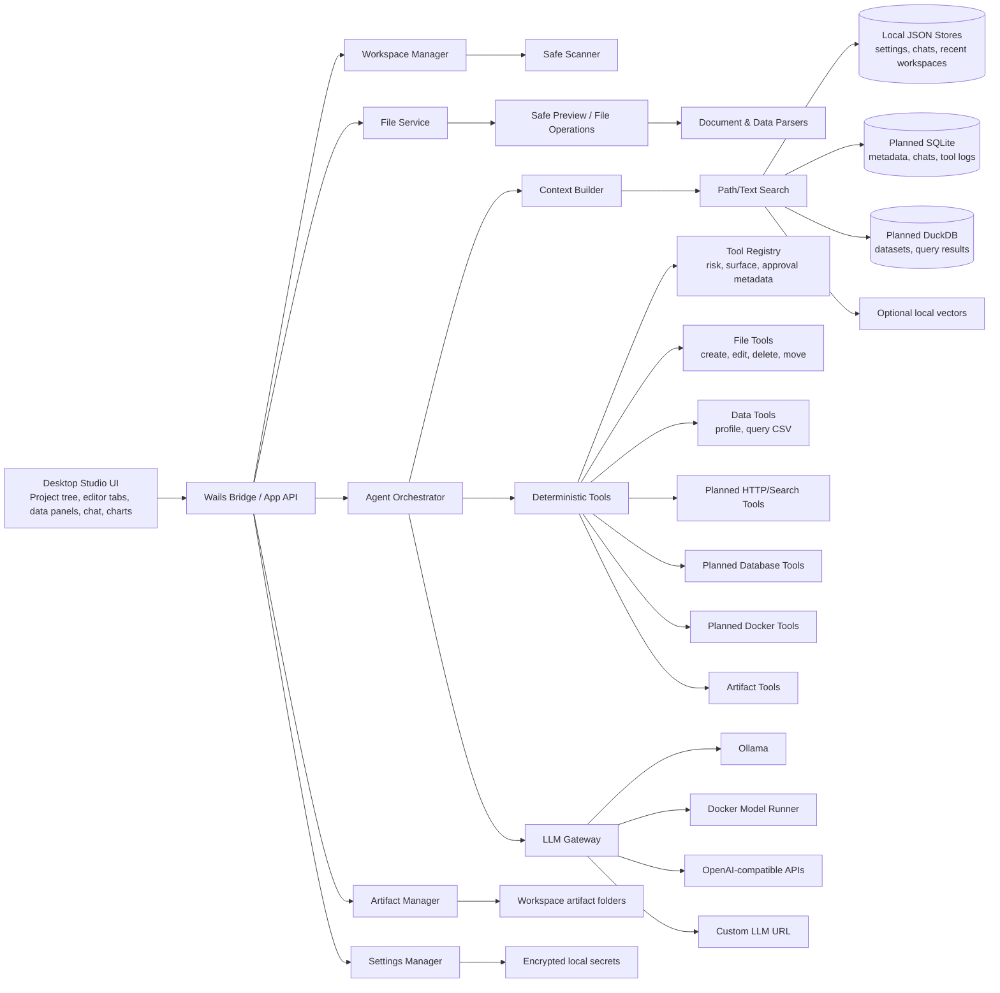

# Architecture

## Architectural Style

NexusDesk should be a modular local-first desktop studio application with a strong Go backend and a rich web-based frontend. The product shape is closer to an IDE/data studio than to a chatbot shell.

The implemented desktop slice currently contains:

- Wails desktop shell
- Go backend
- React frontend
- Monaco-backed source preview and text/code draft editing
- JSON-backed local stores for recent workspaces, LLM settings, and chat history
- OS-protected sidecar credential storage where available
- safe workspace scanner, previewer, search, context-pack builder, and file operation boundaries
- CSV/XLSX dataset profiling, bounded CSV row queries with lightweight filter/order/limit syntax, saved query history, and CSV query exports
- Markdown/CSV/SVG artifact writer with provenance sidecars, metadata lookup, source navigation, archive/delete actions, and artifact search
- CSV chart preview/artifact flow for bar and line charts from category counts or numeric sums
- append-only workspace approval/action log for applied file and artifact operations
- backend agent tool descriptor registry and first frontend tool-plan preview
- read-only Compose parsing for Operations Studio
- configurable LLM gateway
- OpenAI-compatible chat and streaming

The architecture keeps clean seams for later:

- SQLite for app state
- DuckDB for local analytics
- richer document extraction and OCR
- policy-backed approval dialogs
- deterministic agent tool loop
- MCP client support
- external tool plugins
- team/server mode
- Docker Desktop extension
- managed search or vector backends
- enterprise policy and audit

## High-Level Diagram



## Core Modules

### 1. Desktop Shell

Responsibilities:

- launch the local app
- expose Go backend functions to the frontend
- manage native file dialogs
- support Windows, macOS, and Linux builds
- keep app packaging separate from business logic

The shell should be thin. Most behavior should live in backend modules and frontend components.

### 2. Frontend

Responsibilities:

- project and workspace navigation
- file tree
- tabs and editor state
- studio mode surfaces for code, data, analytics, documents, operations, and artifacts
- Monaco-backed code/text previews and draft editing
- image and PDF preview
- CSV table preview and XLSX sheet metadata display
- chat UI
- tool call timeline
- approval dialogs for higher-risk file and artifact actions
- first CSV chart artifacts
- richer charts and dashboards, planned
- settings screens
- artifact browser

The frontend should render structured data from the backend. It should not contain business rules for file permissions, database safety, or Docker safety.

### 3. Workspace Manager

Responsibilities:

- register workspaces
- remember recent workspaces
- enforce workspace root boundaries
- track workspace configuration
- track file scan status and save scan-report artifacts
- coordinate file watchers, planned
- map generated artifacts back to the workspace

A workspace can be code-focused, data-focused, marketing-focused, operations-focused, or mixed. The UI should expose those as studio surfaces rather than hiding everything behind chat.

### 4. File And Document Services

Responsibilities:

- list directories
- read files within allowed roots
- detect file types
- choose preview mode
- extract text from documents
- inspect images
- parse spreadsheets
- create, update, delete, rename, and move files through rooted backend methods
- limit file size and output size
- maintain raw/source hashes

File services must never allow path traversal outside the approved workspace roots.

### 5. Indexing Pipeline

Current responsibilities:

- classify files
- extract searchable text
- index filenames, paths, metadata, and content
- profile datasets

Planned responsibilities:

- create chunks
- track changed files
- schedule document summaries when useful
- store generated summaries separately from source content

Indexing should be incremental and explainable.

### 6. Search And Context Builder

Current responsibilities:

- search filenames, paths, and previewable text content
- build bounded context packs from selected files, directories, or the workspace root
- avoid overloading the model context window

Planned responsibilities:

- search chunks, schemas, conversations, artifacts, and tool results
- rank candidates by relevance and recency
- cite source identifiers in answers

The agent should ask for more context through tools instead of receiving the whole workspace.

### 7. Agent Orchestrator

Current responsibilities:

- manage conversation state
- call the LLM gateway
- feed tool results back to the model
- create final answers and artifacts

Planned responsibilities:

- parse tool requests
- apply tool policies
- request user approvals when needed
- stop loops safely

The agent owns flow control. The LLM owns language generation and reasoning attempts, not permissions.

### 8. LLM Gateway

Responsibilities:

- support configurable base URLs
- support OpenAI-compatible providers
- normalize request and response formats
- support streaming where available
- expose provider capabilities
- enforce timeouts and token limits
- log latency and errors
- support model profiles

Provider support starts with:

- OpenAI-compatible
- Ollama through its OpenAI-compatible endpoint
- custom OpenAI-compatible base URLs

Planned provider support:

- Ollama native
- Docker Model Runner compatible endpoints

### 9. Tool Runner

Current responsibilities:

- implement built-in tools
- describe built-in tools through a registry before model-directed execution
- validate input
- enforce permissions
- cap output size
- record tool runs
- return structured results

Planned responsibilities:

- rate-limit expensive calls
- policy-backed approval decisions
- model-directed tool orchestration
- dry-run plans that can later be executed after approval

Tools should be deterministic and testable.

### 10. Artifact Manager

Responsibilities:

- create output directories
- write generated files
- track artifact metadata
- open source context, archive, and delete generated artifacts through safe backend methods
- create report files
- export bounded CSV query results as CSV artifacts
- render first deterministic SVG chart artifacts from CSV aggregations
- link artifacts to chats and tool runs
- prevent silent overwrites

Planned responsibilities:

- richer chart rendering, export options, and dashboards

Artifacts are the bridge between chat and real work.

### 11. Studio Surface Model

Responsibilities:

- present Code Studio, Data Studio, Analytics Studio, Document Studio, Operations Studio, and Artifact Studio as durable app surfaces
- keep editor tabs, dataset panels, artifact browser, tool timeline, and assistant context visually connected
- make AI actions feel like IDE/data-studio commands, not generic chat shortcuts
- let later modules plug into the same shell without changing the safety model

## Deployment Shape

### Local Developer

```text
wails dev
go backend
frontend dev server
JSON local stores
ollama or custom LLM endpoint
```

### Packaged Desktop

```text
NexusDesk app
embedded frontend assets
Go backend in same process
local JSON config stores today; SQLite later
user-selected model endpoint
```

### Team Or Enterprise Future

```text
desktop client
local file tools
optional team sync service
central policy server
shared model gateway
audit export
connector credential vault
```

### Docker Desktop Extension Future

```text
Docker Desktop UI extension
Go extension backend
Docker Engine API access
NexusDesk agent modules
model runner integration
```

## Key Design Decisions

NexusDesk should not let the LLM directly operate the machine.

The safe pattern is:

```text
LLM requests action
  ->
Agent parses request
  ->
Policy engine evaluates risk
  ->
User approves if needed
  ->
Tool runner performs action
  ->
Tool result is logged and returned
```

The LLM should help reason over the workspace, but deterministic Go modules should own IO, permissions, data parsing, indexing, queries, Docker access, and artifact writes.
