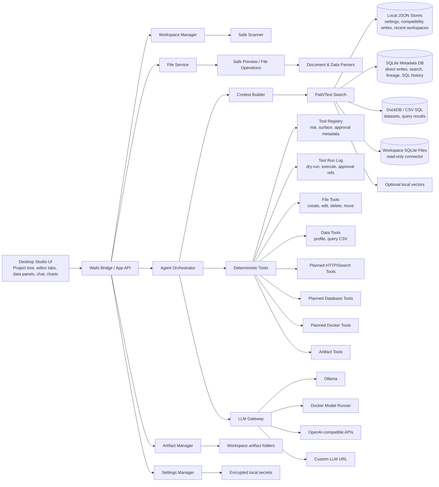

# Architecture

## Architectural Style

Nexus Augentic Studio should be a modular local-first desktop studio application with a strong Go backend and a rich web-based frontend. The product shape is closer to an IDE/data studio than to a chatbot shell.

The implemented desktop slice currently contains:

- Wails desktop shell
- Go backend
- React frontend
- Monaco-backed source preview and text/code draft editing
- JSON-backed local stores for recent workspaces, LLM settings, and chat history
- OS-protected sidecar credential storage where available
- safe workspace scanner, previewer, search, context-pack builder, and file operation boundaries
- CSV/XLSX dataset profiling, bounded CSV row queries with lightweight filter/order/limit syntax, saved query history, and CSV query exports
- Markdown/CSV/SVG artifact writer with provenance sidecars, metadata lookup, source navigation, archive/delete actions, and artifact search
- CSV chart preview/artifact flow for bar and line charts from category counts or numeric sums
- append-only workspace approval/action log for applied file and artifact operations
- backend agent tool descriptor registry and first frontend tool-plan preview
- persisted tool-run dry-runs/executions with approval references
- SQLite metadata initialization, JSON-store migration compatibility, direct repository-backed writes for fresh chat/approval/artifact/tool-run rows, metadata history search, dataset dependency records, and SQL run history
- DuckDB-capable read-only SQL surface over datasets, with CGO-tagged driver execution and bounded CSV fallback
- first read-only SQLite workspace database connector for `.sqlite`, `.sqlite3`, and `.db` files, with visible per-query row caps, timeouts, cancellation, schema-object browsing, relationship hints, selected-object schema explanation, saved connector queries, query history, CSV/Markdown exports, artifact lineage, and redacted connector errors
- first read-only PostgreSQL profile runner for explicit user-triggered connection tests, schema inspection, and guarded `SELECT`/`WITH` queries through protected connector credentials
- first read-only MySQL/MariaDB profile runner with the same explicit test/inspect/query boundary, guarded SQL validation, schema metadata, and relationship hints
- first read-only SQL Server profile runner with explicit test/inspect/query methods, guarded SQL validation, schema metadata, and relationship hints
- first DuckDB profile runner boundary with default build validation/clear CGO guidance and real read-only test/inspect/query execution behind the `duckdb` build tag
- artifact comparison for generated output versions
- selectable artifact lineage graph and workspace freshness snapshots for source-aware generated outputs
- artifact lineage JSON export/import for debugging and future sync workflows
- Metadata Browser for SQLite tables, filtered columns, copyable sample rows, and dataset SQL views
- separate saved SQL snippets and lightweight row filters per dataset
- SQL result Markdown artifacts with query, engine, row count, preview, and source citation metadata
- read-only Compose parsing for Operations Studio
- read-only Git status, branch, changed-file list, staged/unstaged grouping, staged diff, working-tree diff, selected-file diff loading, and approval-backed stage/unstage/hunk actions for Workbench
- configurable LLM gateway
- OpenAI-compatible chat and streaming

The architecture keeps clean seams for later:

- SQLite for app state
- DuckDB for local analytics
- richer document extraction and OCR
- policy-backed approval dialogs
- deterministic agent tool loop
- MCP client support
- external tool plugins
- team/server mode
- Docker Desktop extension
- managed search or vector backends
- enterprise policy and audit

## High-Level Diagram



## Core Modules

### 1. Desktop Shell

Responsibilities:

- launch the local app
- expose Go backend functions to the frontend
- manage native file dialogs
- support Windows, macOS, and Linux builds
- keep app packaging separate from business logic

The shell should be thin. Most behavior should live in backend modules and frontend components.

Current implementation note: `app/app.go` is still the Wails-facing application adapter. `app/workspace_service.go` now owns workspace open/refresh/search/read/file mutation/freshness orchestration, `app/artifact_service.go` owns core artifact report/list/metadata/archive/delete/compare orchestration, `app/dataset_service.go` owns profiling/query/SQL/connector/chart/summary/dependency rebuild orchestration, and `app/app_metadata.go` owns app-level metadata mirroring and metadata record orchestration. Future backend refactors should continue moving cohesive use cases out of the bridge file without changing Wails contracts casually.

### 2. Frontend

Responsibilities:

- project and workspace navigation
- file tree
- tabs and editor state
- Workbench git visibility and project-tree context actions
- studio mode surfaces for code, data, analytics, documents, operations, and artifacts
- Monaco-backed code/text previews and draft editing
- image and PDF preview
- CSV table preview and XLSX sheet metadata display
- chat UI
- tool call timeline
- approval dialogs for higher-risk file and artifact actions
- first CSV chart artifacts
- richer charts and dashboards, planned
- settings screens
- artifact browser

The frontend should render structured data from the backend. It should not contain business rules for file permissions, database safety, or Docker safety.

Current implementation note: generated Wails bindings are imported through `app/frontend/src/api/wailsClient.ts`, not directly from feature components. `NexusShell.tsx` remains the main orchestrator, but panel resize state, studio-route state, Git workflows, Code AI prompt/patch helpers, and editor-outline extraction/presentation now live in focused modules so future workspace, chat, artifact, and data controllers can follow the same pattern.

### Current Architecture Review

Review status as of the latest full project pass:

- The product shape is still sound: a small primary rail for Workbench, Data & Analytics, Artifacts, and Settings, with the AI assistant always visible.
- The backend has useful service facades for workspace, dataset, artifact, and git workflows, but `app/app.go` is still large and still owns chat/context, metadata orchestration, and several bridge-specific helpers.
- The frontend has good feature panels and the Wails API adapter boundary is clean, but `NexusShell.tsx` remains the main state owner. SQLite connector caps/timeouts/cancellation and PostgreSQL profile test/inspect actions are now wired through that shell; further connector growth should move into a focused data/controller hook before adding notebooks or more engines.
- Git work is correctly manual on folder open, so opening a workspace should not launch external Git commands or desktop command windows.
- Code AI actions now reuse the chat/artifact pipeline and route accepted single-file patch drafts through the existing safe write preview/apply boundary.
- Slow or external future work, especially OCR, dump imports, connector pulls, deeper indexing, and long agent runs, must go through a job runner before it is attached to folder-open or route-load flows.

Near-term architecture corrections:

- Extract chat/context/agent state into a `useChatController` and a backend `ChatService`.
- Extract artifact and dataset frontend state into controller hooks before adding more route depth.
- Complete ArtifactService ownership for lineage/regeneration so artifact workflows do not drift back into `app/app.go`.
- Add a durable job model and keep folder open limited to bounded first-render scanning.
- Promote SQLite metadata repositories to primary persistence once migration/recovery tests exist.

### 3. Workspace Manager

Responsibilities:

- register workspaces
- remember recent workspaces
- enforce workspace root boundaries
- track workspace configuration
- track file scan status and save scan-report artifacts
- coordinate file freshness snapshots and later file watchers
- map generated artifacts back to the workspace

A workspace can be code-focused, data-focused, marketing-focused, operations-focused, or mixed. The UI should expose those as studio surfaces rather than hiding everything behind chat.

### 4. File And Document Services

Responsibilities:

- list directories
- read files within allowed roots
- detect file types
- choose preview mode
- extract text from documents
- inspect images
- parse spreadsheets
- create, update, delete, rename, and move files through rooted backend methods
- limit file size and output size
- maintain raw/source hashes

File services must never allow path traversal outside the approved workspace roots.

### 5. Indexing Pipeline

Current responsibilities:

- classify files
- extract searchable text
- index filenames, paths, metadata, and content
- profile datasets

Planned responsibilities:

- create chunks
- track changed files, warn on stale chat/context sources, and mark generated artifacts stale
- schedule document summaries when useful
- store generated summaries separately from source content

Indexing should be incremental and explainable.

### 6. Search And Context Builder

Current responsibilities:

- search filenames, paths, and previewable text content
- build bounded context packs from selected files, directories, or the workspace root
- avoid overloading the model context window
- expose read-only Git repository status and working-tree diff for Workbench

Planned responsibilities:

- search chunks, schemas, conversations, artifacts, and tool results
- rank candidates by relevance and recency
- cite source identifiers in answers
- surface stale-context warnings when cited files change

The agent should ask for more context through tools instead of receiving the whole workspace.

### 7. Agent Orchestrator

Current responsibilities:

- manage conversation state
- call the LLM gateway
- feed tool results back to the model
- create final answers and artifacts
- parse tool requests
- apply tool policies
- stop loops safely

Current implementation:

- `app/internal/agent/` owns the backend ReAct loop, system prompt, plan updates, action parsing, observation handling, and memory pruning.
- `app/agent_runtime.go` exposes `RunAgent` and maps model-requested tools to deterministic workspace, data, artifact, shell, and registered agent-tool handlers.
- High-impact tools are blocked unless the backend request explicitly enables approval, and shell commands require a separate shell flag.

Planned responsibilities:

- stream each agent step into the frontend as it happens
- request interactive user approvals mid-loop instead of requiring approval flags before the call starts
- add a structured patch validator before exposing raw patch application

The agent owns flow control. The LLM owns language generation and reasoning attempts, not permissions.

### 8. LLM Gateway

Responsibilities:

- support configurable base URLs
- support OpenAI-compatible providers
- normalize request and response formats
- support streaming where available
- expose provider capabilities
- enforce timeouts and token limits
- log latency and errors
- support model profiles

Provider support starts with:

- OpenAI-compatible
- Ollama through its OpenAI-compatible endpoint
- custom OpenAI-compatible base URLs

Planned provider support:

- Ollama native
- Docker Model Runner compatible endpoints

### 9. Tool Runner

Current responsibilities:

- implement built-in tools
- describe built-in tools through a registry before model-directed execution
- validate input
- enforce permissions
- cap output size
- record tool runs
- return structured results

Planned responsibilities:

- rate-limit expensive calls
- policy-backed approval decisions
- model-directed tool orchestration
- dry-run plans that can later be executed after approval

Tools should be deterministic and testable.

### 10. Artifact Manager

Responsibilities:

- create output directories
- write generated files
- track artifact metadata
- open source context, archive, and delete generated artifacts through safe backend methods
- create report files
- export bounded CSV query results as CSV artifacts
- render first deterministic SVG chart artifacts from CSV aggregations
- link artifacts to chats, tool runs, source files, and generated outputs through filterable/selectable lineage
- prevent silent overwrites

Planned responsibilities:

- richer chart rendering, export options, and dashboards

Artifacts are the bridge between chat and real work.

### 11. Studio Surface Model

Responsibilities:

- present Workbench, Data & Analytics, Artifacts, and Settings as durable app surfaces
- keep Analytics, Documents, Operations, and AI orchestration as context-aware capability domains until they justify first-class surfaces
- make the primary rail/main menu a real workspace router, not a roadmap label strip
- preserve per-studio state: selected tab, open resources, filters, query history, task state, and assistant context
- keep editor tabs, dataset panels, artifact browser, tool timeline, and assistant context visually connected
- make AI actions feel like IDE/data-studio commands, not generic chat shortcuts
- let later modules plug into the same shell without changing the safety model

Target studio ownership:

- Workbench owns IDE navigation, git status/diffs, editor groups, search, problems, symbols, tests/tasks, and code patch workflows.
- Data & Analytics owns file datasets, spreadsheets, database connectors, dump imports, temporary Docker-backed database sandboxes, schemas, query notebooks, profiling, charts, data research artifacts, and marketing/CRM analytics imports.
- Connector metadata starts as a read-only, user-triggered inspection model under Data & Analytics. The first SQLite schema browser can select tables/views, show columns/indexes/samples, and run capped row previews only after an explicit user action; workspace open may classify database files but must not inspect schemas, execute queries, or open connectors automatically.
- Analytics-specific connectors are a subdomain of Data & Analytics until they need a dedicated layout.
- Document Studio owns document extraction, OCR, document sets, comparison, redline/comment workflows, generated reports, and generated presentations.
- AI Assistant owns context selection, model/provider controls, tool plans, agent modes, citations, memory, and cross-surface orchestration as an always-visible layer.
- Operations owns Docker/Compose inspection, logs, local services, ports, health checks, safe operations, and generated runbooks/configs as a capability domain until native Ops screens land.
- Artifact Studio owns generated outputs, lineage, comparison, reproducibility metadata, archive/delete, and source navigation.

## Deployment Shape

### Local Developer

```text
wails dev
go backend
frontend dev server
JSON local stores
ollama or custom LLM endpoint
```

### Packaged Desktop

```text
Nexus Augentic Studio app
embedded frontend assets
Go backend in same process
local JSON config stores today; SQLite later
user-selected model endpoint
```

The packaged backend may launch bounded external child processes for user-triggered read-only Git status/diff inspection and approved agent shell tools. Windows builds configure those children as hidden/no-console processes so workspace tooling does not flash terminal windows over the desktop UI.

### Team Or Enterprise Future

```text
desktop client
local file tools
optional team sync service
central policy server
shared model gateway
audit export
connector credential vault
```

The current connector profile foundation stores only non-secret connection metadata in local app config. Passwords and tokens are written to protected sidecar storage and exposed to the UI as redacted credential references. Current SQLite connector calls use explicit row caps, timeouts, cancellation IDs, and redacted errors even though they do not need stored credentials. PostgreSQL, MySQL/MariaDB, SQL Server, and DuckDB profile actions resolve protected credentials only when the user explicitly tests, inspects, or queries a saved profile; the backend opens a read-only session where the engine supports it, applies statement timeouts, and rejects non-`SELECT` SQL before execution. DuckDB live execution is additionally gated by the optional CGO `duckdb` build tag. Future connector runners must follow that same credential-at-execution boundary after policy checks and explicit user-triggered connector actions.

### Docker Desktop Extension Future

```text
Docker Desktop UI extension
Go extension backend
Docker Engine API access
Nexus Augentic Studio agent modules
model runner integration
```

## Key Design Decisions

Nexus Augentic Studio should not let the LLM directly operate the machine.

The safe pattern is:

```text
LLM requests action
  ->
Agent parses request
  ->
Policy engine evaluates risk
  ->
User approves if needed
  ->
Tool runner performs action
  ->
Tool result is logged and returned
```

The LLM should help reason over the workspace, but deterministic Go modules should own IO, permissions, data parsing, indexing, queries, Docker access, and artifact writes.
