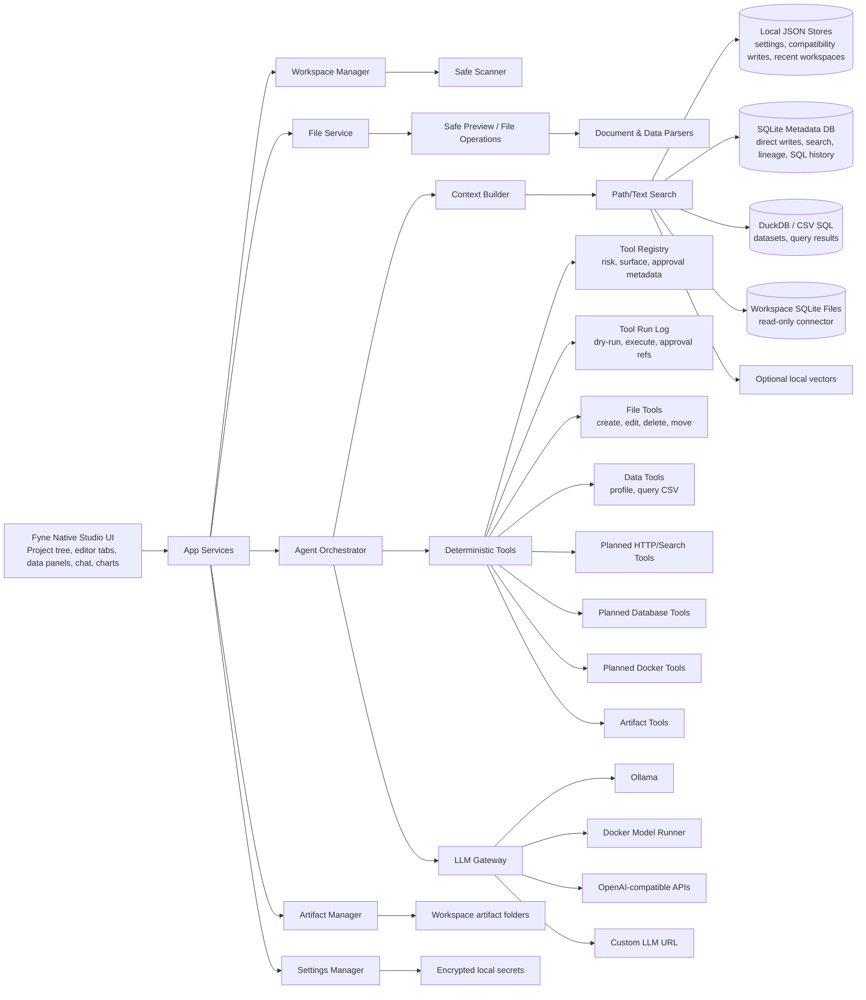

# Architecture

## Architectural Style

Nexus Augentic Studio should be a modular local-first desktop studio application with a strong Go backend and a native desktop frontend. The product shape is closer to an IDE/data studio than to a chatbot shell.

The project is now in a breaking migration from Wails/React to Fyne:

- `app-wails/` preserves the existing Wails/React implementation as the reference application.
- `nexus-app/` is the new Fyne-native application.
- The target root rule for `nexus-app/` is strict: keep `main.go`, `go.mod`, and `go.sum` at the module root; put application code under `internal/` by domain, service, platform, and UI responsibility.
- New backend services should be ported into `nexus-app/internal/services/`, not copied into a giant app root.

The preserved Wails reference slice currently contains:

- Wails desktop shell, now under `app-wails/`
- Go backend
- React frontend
- Monaco-backed source preview and text/code draft editing
- JSON-backed local stores for recent workspaces, LLM settings, and chat history
- OS-protected sidecar credential storage where available
- safe workspace scanner, previewer, search, context-pack builder, file operation boundaries, and bounded rollback snapshots for approved file mutations
- CSV/XLSX dataset profiling, bounded CSV row queries with lightweight filter/order/limit syntax, saved query history, and CSV query exports
- Markdown/CSV/SVG artifact writer with provenance sidecars, metadata lookup, source navigation, archive/delete actions, and artifact search
- CSV chart preview/artifact flow for bar and line charts from category counts or numeric sums
- append-only workspace approval/action log for applied file and artifact operations
- backend agent tool descriptor registry and first frontend tool-plan preview
- persisted tool-run dry-runs/executions with approval references
- SQLite metadata initialization, JSON-store migration compatibility, direct repository-backed writes for fresh chat/approval/artifact/tool-run rows, metadata history search, dataset dependency records, and SQL run history
- DuckDB-capable read-only SQL surface over datasets, with CGO-tagged driver execution and bounded CSV fallback
- first read-only SQLite workspace database connector for `.sqlite`, `.sqlite3`, and `.db` files, with visible per-query row caps, timeouts, cancellation, schema-object browsing, relationship hints, selected-object schema explanation, saved connector queries, query history, CSV/Markdown exports, artifact lineage, and redacted connector errors
- first read-only PostgreSQL profile runner for explicit user-triggered connection tests, schema inspection, and guarded `SELECT`/`WITH` queries through protected connector credentials
- first read-only MySQL/MariaDB profile runner with the same explicit test/inspect/query boundary, guarded SQL validation, schema metadata, and relationship hints
- first read-only SQL Server profile runner with explicit test/inspect/query methods, guarded SQL validation, schema metadata, and relationship hints
- first DuckDB profile runner boundary with default build validation/clear CGO guidance and real read-only test/inspect/query execution behind the `duckdb` build tag
- generalized request IDs, timeout/cap normalization, cancellation callbacks, and redacted errors for external connector profile queries
- shared connector metadata browser for workspace SQLite and saved external SQL profile inspections
- artifact comparison for generated output versions
- selectable artifact lineage graph and workspace freshness snapshots for source-aware generated outputs
- artifact lineage JSON export/import for debugging and future sync workflows
- Metadata Browser for SQLite tables, filtered columns, copyable sample rows, and dataset SQL views
- separate saved SQL snippets and lightweight row filters per dataset
- SQL result Markdown artifacts with query, engine, row count, preview, and source citation metadata
- read-only Compose parsing for Operations Studio
- read-only Git status, branch, changed-file list, staged/unstaged grouping, staged diff, working-tree diff, selected-file diff loading, bounded history/blame context, and approval-backed stage/unstage/hunk actions for Workbench
- configurable LLM gateway
- OpenAI-compatible chat and streaming

The Fyne migration keeps clean seams for later:

- SQLite for app state
- DuckDB for local analytics
- native workspace SQLite connector inspection under `nexus-app/internal/services/dbconnector`, triggered only by explicit Data & Analytics actions
- richer document extraction and OCR
- policy-backed approval dialogs
- deterministic agent tool loop
- MCP client support
- external tool plugins
- team/server mode
- Docker Desktop extension
- managed search or vector backends
- enterprise policy and audit

## High-Level Diagram



## Core Modules

### 1. Desktop Shell

Responsibilities:

- launch the local app
- expose Go backend functions to the frontend
- manage native file dialogs
- support Windows, macOS, and Linux builds
- keep app packaging separate from business logic

The shell should be thin. Most behavior should live in backend services and focused native UI components.

Current migration note: `app-wails/` keeps the old Wails adapter and services for reference. `nexus-app/internal/app/` owns only native app lifecycle and window setup. New code should place domain models in `nexus-app/internal/domain/`, UI-independent use cases in `nexus-app/internal/services/`, and Fyne widgets/layouts in `nexus-app/internal/ui/`. The native shell is split by responsibility (`view`, `panels`, `tabs`, `workspace_actions`, activity, tree, and preview files) so UI growth does not recreate a monolithic shell.

The Fyne shell now owns native desktop affordances directly: approved brand icon/logo assets are embedded under `nexus-app/internal/brand`, the window installs a native menu bar, and common IDE-like shortcuts are registered through a focused shortcut file rather than scattered callbacks.

Preview data remains framework-free: `nexus-app/internal/services/workspace` classifies text, image, table, document, PDF, and binary previews and returns capped data, while `nexus-app/internal/ui/shell` chooses Fyne widgets for rendering. `nexus-app/internal/services/spreadsheets` owns the first dependency-light XLSX OpenXML reader for bounded workbook sheet rows, keeping spreadsheet parsing outside UI code. The first native document-intelligence boundary is `nexus-app/internal/services/documents`, which consumes preview-safe text and extracts bounded Markdown, TXT, HTML, XML, DOCX, XLSX, and PDF text plus simple metadata without importing Fyne or writing files directly. PDF extraction records page counts when embedded text is available; scanned/OCR-only PDFs remain a later job-backed workflow. The first native data boundary is `nexus-app/internal/services/datasets`, which profiles selected CSV, TSV, JSON, NDJSON/JSONL, XLSX, log, and Parquet metadata from rooted safe reads, returns structured field summaries, decodes bounded Parquet footer metadata for schema columns and row-group byte/row summaries without scanning values or adding a heavy reader dependency, runs bounded row queries with global search, column filters, numeric comparisons, order, and limit clauses for CSV/TSV/JSON/NDJSON/XLSX/log data, builds deterministic SVG bar charts for categorical data, line charts for ordered date/numeric series, richer dashboard SVGs with KPI cards and dataset notes, exposes a constrained SELECT-only SQL adapter over the selected dataset with projection, one predicate, ordering, limits, mutation blocking, and deterministic plan text, and persists the first native per-dataset SQL notebook model under `.nexusdesk/datasets/notebooks.json` with bounded cells and lineage metadata. Parquet value reads remain deferred until a full reader/import decision is made. The Fyne Data panel dispatches profile/query/SQL/notebook/chart/dashboard intents to services without importing data rules into UI packages.

File mutation data remains framework-free as well: `nexus-app/internal/services/workspace` now owns rooted text/code write previews, append/apply flows, encoding-aware writes, file create/delete/copy/move/rename operations, and rollback snapshots under `.nexusdesk/rollbacks`. The native draft editor Save action calls this service, promotes the saved draft back into the editor session source state, and never writes directly from a widget callback.

Agent-authored file mutations use that same framework-free mutation boundary. The native deterministic tool dispatcher exposes approval-gated `write_file`, `append_file`, `copy_file`, `move_file`, `delete_file`, and `apply_patch` tools, but they only run when scoped full-project access is active and still call the workspace safe mutation services so traversal protection, `.nexusdesk` guards, text/binary checks, encoding rules, exact-match unified patch validation, diff observations, and rollback snapshots stay centralized.

Workspace search remains framework-free: `nexus-app/internal/services/workspace` owns bounded path/content search, while the Fyne shell owns only the toolbar entry, bottom Search tab, and result-to-preview navigation.

Workspace context packing remains framework-free too: `nexus-app/internal/services/workspace/context.go` expands explicit file, directory, or project-root context paths into capped preview-safe packs, while assistant/UI code only chooses which paths to request.

Workspace problem scanning follows the same split: `nexus-app/internal/services/workspace` owns bounded marker, merge-conflict, and invalid JSON detection, while the Fyne shell owns only the bottom Problems tab and result-to-preview navigation.

Git integration is also service-led: `nexus-app/internal/services/git` owns manual repository status discovery, porcelain parsing, staged/unstaged grouping, read-only selected-file diff loading, diff hunk parsing, file-level stage/unstage actions, index-only hunk stage/unstage patches, path validation, output caps, and Windows hidden-process execution. The Fyne shell owns only the bottom Git refresh button, status rendering, project-tree badges from the last manual refresh, directory grouping for changed files, hunk navigation state, confirmed stage/unstage intents, and read-only unified/split/diff-only diff rendering.

Task execution follows the same boundary: `nexus-app/internal/services/tasks` owns bounded workspace task discovery, noisy-directory skips, task ID generation, rediscovery before execution, command allow-listing for npm scripts, Go tests, and Docker Compose config checks, rooted working-directory validation, timeouts, capped output, and hidden Windows child-process execution. `nexus-app/internal/services/operations` owns manual read-only operations scans for Dockerfiles, Compose files, env/config/script/log files, bounded text inspection, environment-like secret redaction, lightweight Compose service extraction, and Compose topology summaries for service dependencies, port exposures, and named volumes without running Docker, shell, or service commands. Explicit Compose validation is a UI-confirmed Operations action that resolves the selected Compose file to a discovered safe task and then runs `docker compose config` through the task/job pipeline; workspace open, scan, and inspect remain non-executing. `nexus-app/internal/services/jobs` owns job IDs, status, log tail, completion state, cancellation contexts, and an optional repository hook. `nexus-app/internal/services/metadata` now provides SQLite repositories for persisted jobs, task-run records, chat messages, agent/tool audit records, generated-artifact rows, SQL run rows, and dataset dependency rows under `.nexusdesk/metadata`, including task report artifact paths, artifact source paths, SQL status/count/timing data, and source-to-dependent lineage. `nexus-app/internal/services/artifacts` owns generated Markdown task-run reports under `.nexusdesk/artifacts/task-runs`, document-set Markdown reports under `.nexusdesk/artifacts/document-sets`, document extraction reports for Markdown/TXT/HTML/XML/DOCX/XLSX/PDF sources under `.nexusdesk/artifacts/document-extracts`, operations runbooks under `.nexusdesk/artifacts/operations-runbooks`, deterministic SVG chart artifacts under `.nexusdesk/artifacts/charts`, artifact-comparison reports under `.nexusdesk/artifacts/comparisons`, JSON sidecar metadata with bounded source SHA-256 fingerprints, recursive artifact listing, metadata search, archive/delete/restore, bounded preview reads, task/document/chart/operations report lineage, same-kind artifact comparison diffs, and source freshness checks for missing, modified, or same-timestamp changed cited files. The Fyne shell owns only the bottom Tasks, Jobs, Operations, and Artifacts tabs, task discovery button, confirmation prompt, cancel intent, read-only last-run output, operations scan/inspect/Compose-validation/runbook export intent, data query/SQL/chart/export/history intent, document extraction/report generation intent, artifact search/listing, artifact-to-assistant context pinning, source-file open/pin actions, compare selection/export intent, archived-artifact restore intent, SQLite artifact-row upserts after explicit writes/refreshes, and read-only artifact preview/lineage/freshness/diff rendering. UI and future agent code must request discovered task IDs rather than sending arbitrary shell commands into this service.

Persisted conversation history follows the metadata boundary too. `nexus-app/internal/services/metadata` owns chat message writes, recent conversation loading, bounded chat search, generated-artifact row storage/search, SQL run records, dataset dependency records, and bounded Wails-era compatibility importers. On workspace open, the native shell ensures SQLite metadata and asks the metadata service to import matching legacy chat history, approval logs, artifact `.meta.json` sidecars, tool-run logs, and legacy Wails SQLite dataset SQL/dependency rows; the shell does not parse those JSON files or SQLite tables itself. Legacy Wails dataset tables are preserved under backup table names before the native schema is recreated and converted rows are written into the new metadata shape. The Fyne shell owns only the assistant sidebar preview, bottom Chat tab presentation, Data panel SQL history action, and user intent to seed the assistant composer from a prior record. `nexus-app/internal/services/history` now composes metadata and artifact services into the first unified workspace history feed across chat messages, data SQL/dependency records, generated artifacts, jobs, and agent audit records, preferring SQLite artifact rows and falling back to filesystem sidecars for older workspaces that have not refreshed artifacts yet. The Fyne History tab renders filters, details, and jump actions back into the existing Chat, Data, Artifacts, Jobs, and Agent Audit surfaces; it does not read SQLite or artifact files directly from widgets.

Rollback browsing follows the same boundary: `nexus-app/internal/services/workspace` owns rollback records and apply semantics, while the Fyne shell owns only record listing, confirmation, and workspace refresh after apply. The native tool dispatcher exposes `list_rollbacks` and approval-gated `rollback_file_mutation` for future agent runs so model-authored workspace mutations can be inspected and undone through the same rollback service rather than a separate agent-only path.

Workspace tree actions call the same service boundary: the Fyne navigator quick-action strip and tree-row secondary-click context menus collect user intent and confirmation, then dispatch create, copy, rename/move, and delete through `nexus-app/internal/services/workspace` so rollback and rooted validation stay centralized. The tree is lazy by default, has explicit expand/collapse controls, and can show normally ignored folders only through a user toggle; `.nexusdesk` metadata and symlinks remain hidden even in that diagnostic view. Clipboard/path and assistant-context affordances stay UI-only helpers; they do not bypass the workspace service for mutations.

Native approvals are split into `nexus-app/internal/services/approvals` for append-only approval records plus scoped full-project access policy, `nexus-app/internal/services/metadata` for SQLite approval-row persistence, and `nexus-app/internal/ui/shell` for the bottom Approvals tab. Full project access is persisted under `.nexusdesk/approvals/policy.json`, scoped to the active workspace root, time-limited, and audited in `.nexusdesk/approvals/log.json`; fresh records also write to `approval_records` when the active metadata store is available, while JSON remains the compatibility fallback. This does not enable arbitrary shell execution; shell remains a separate high-risk policy.

Native settings are split into `nexus-app/internal/services/settings` for non-secret provider/model/context persistence and `nexus-app/internal/ui/shell` for the Settings tab. Secret storage remains separate future work.

Native LLM transport is service-owned: `nexus-app/internal/services/llm` owns OpenAI-compatible chat, streaming chat, provider model probes, Ollama runtime probes, context-window options, response reserve, and workspace-context sentinel escaping. The Fyne assistant panel calls it through `nexus-app/internal/services/assistant` for Ask mode and `nexus-app/internal/services/agent` plus `nexus-app/internal/services/tools` for Agent mode. Widgets own only prompt composition, explicit context-pin controls, compact recent-history display, the compact live activity tail, job/audit handoff, final answer replacement, and read-only audit rendering; provider calls, context-pack construction, recent chat persistence, agent loops, deterministic tool dispatch, and SQLite audit records stay in services. Agent mode now receives the same pinned or selected context pack as Ask mode, including explicitly pinned generated artifacts under `.nexusdesk/artifacts`.

### 2. Frontend

Responsibilities:

- project and workspace navigation
- file tree
- tabs and editor state
- Workbench git visibility and project-tree context actions
- studio mode surfaces for code, data, analytics, documents, operations, and artifacts
- Monaco-backed code/text previews and draft editing
- image and PDF preview
- CSV table preview and XLSX sheet metadata display
- chat UI
- tool call timeline
- approval dialogs for higher-risk file and artifact actions
- first CSV chart and dashboard SVG artifacts
- saved dashboard builders and richer chart editing, planned
- settings screens
- artifact browser

The frontend should render structured data from the backend. It should not contain business rules for file permissions, database safety, or Docker safety.

Current implementation note: generated Wails bindings are imported through `app/frontend/src/api/wailsClient.ts`, not directly from feature components. `NexusShell.tsx` remains the main orchestrator, but panel resize state, studio-route state, Git workflows, Code AI prompt/patch helpers, and editor-outline extraction/presentation now live in focused modules so future workspace, chat, artifact, and data controllers can follow the same pattern.

### Current Architecture Review

Review status as of the latest full project pass:

- The product shape is still sound: a small primary rail for Workbench, Data & Analytics, Artifacts, and Settings, with the AI assistant always visible.
- The Wails backend has useful service facades for workspace, dataset, artifact, git, and agent-runtime workflows. Those should be ported capability-by-capability into `nexus-app/internal/services/`.
- The React frontend has good workflow references, but it should not dictate the new native structure. Fyne UI should be rebuilt around native panels, menus, dialogs, tabs, jobs, and approval surfaces.
- Git work is correctly manual on folder open, so opening a workspace should not launch external Git commands or desktop command windows.
- Code AI actions now reuse the chat/artifact pipeline and route accepted single-file patch drafts through the existing safe write preview/apply boundary.
- Slow or external future work, especially OCR, dump imports, connector pulls, deeper indexing, and long agent runs, must go through a job runner before it is attached to folder-open or route-load flows.

Near-term architecture corrections:

- Configure Windows CGO/Fyne toolchain and verify the native app runs.
- Add native UI affordances for file operations and rollback browsing while keeping the mutation policy in `nexus-app/internal/services/workspace`.
- Keep editor tab/session and draft rules in `nexus-app/internal/services/editor` rather than in Fyne widget callbacks; Fyne editor chrome should only render and dispatch those state transitions.
- Port remaining assistant/agent, data, artifact, and metadata services without recreating a bridge-shaped root package.
- Route additional slow workflows through the durable job model now that task jobs support cancellation, retry from persisted task-run records, and opening task-report outputs.
- Promote SQLite metadata repositories to primary persistence once migration/recovery tests exist.

### 3. Workspace Manager

Responsibilities:

- register workspaces
- remember recent workspaces
- enforce workspace root boundaries
- track workspace configuration
- track file scan status and save scan-report artifacts
- coordinate file freshness snapshots and later file watchers
- map generated artifacts back to the workspace

A workspace can be code-focused, data-focused, marketing-focused, operations-focused, or mixed. The UI should expose those as studio surfaces rather than hiding everything behind chat.

### 4. File And Document Services

Responsibilities:

- list directories
- read files within allowed roots
- detect file types
- choose preview mode
- extract text from documents
- inspect images
- parse spreadsheets
- create, update, delete, rename, and move files through rooted backend methods
- limit file size and output size
- maintain raw/source hashes

File services must never allow path traversal outside the approved workspace roots.

### 5. Indexing Pipeline

Current responsibilities:

- classify files
- extract searchable text
- index filenames, paths, metadata, and content
- profile datasets

Planned responsibilities:

- create chunks
- track changed files, warn on stale chat/context sources, and mark generated artifacts stale
- schedule document summaries when useful
- store generated summaries separately from source content

Indexing should be incremental and explainable.

### 6. Search And Context Builder

Current responsibilities:

- search filenames, paths, and previewable text content
- build bounded context packs from selected files, directories, or the workspace root
- avoid overloading the model context window
- expose read-only Git repository status and working-tree diff for Workbench

Planned responsibilities:

- search chunks, schemas, conversations, artifacts, and tool results
- rank candidates by relevance and recency
- cite source identifiers in answers
- surface stale-context warnings when cited files change

The agent should ask for more context through tools instead of receiving the whole workspace.

### 7. Agent Orchestrator

Current responsibilities:

- manage conversation state
- call the LLM gateway
- feed tool results back to the model
- create final answers and artifacts
- parse tool requests
- apply tool policies
- stop loops safely

Current implementation:

- `app/internal/agent/` owns the backend ReAct loop, system prompt, plan updates, action parsing, observation handling, and memory pruning.
- `app/agent_runtime.go` exposes `RunAgent` and maps model-requested tools to deterministic workspace, data, artifact, shell, and registered agent-tool handlers.
- High-impact tools are blocked unless the backend request explicitly enables approval, and shell commands require a separate shell flag.

Planned responsibilities:

- stream each agent step into the frontend as it happens
- request interactive user approvals mid-loop instead of requiring approval flags before the call starts
- add a structured patch validator before exposing raw patch application

The agent owns flow control. The LLM owns language generation and reasoning attempts, not permissions.

### 8. LLM Gateway

Responsibilities:

- support configurable base URLs
- support OpenAI-compatible providers
- normalize request and response formats
- support streaming where available
- expose provider capabilities
- enforce timeouts and token limits
- log latency and errors
- support model profiles

Provider support starts with:

- OpenAI-compatible
- Ollama through its OpenAI-compatible endpoint
- custom OpenAI-compatible base URLs

Current native status:

- `nexus-app/internal/services/llm` implements the OpenAI-compatible chat/completions transport, streaming SSE delta parsing, `/models` probing, Ollama `/api/ps` runtime diagnostics, and context-window/response-reserve request fields.
- It accepts `llm.Config` and adapts from the native non-secret settings store with `ConfigFromSettings`.
- It keeps workspace context quoted behind Nexus sentinels and escapes fence/sentinel strings from file content before model submission.
- `nexus-app/internal/services/assistant` wraps the LLM client for the Fyne assistant panel, streams deltas, and attaches bounded context packs from selected workspace files, directories, or the project root.

Planned provider support:

- Ollama native
- Docker Model Runner compatible endpoints

### 9. Tool Runner

Current responsibilities:

- implement built-in tools
- describe built-in tools through a registry before model-directed execution
- validate input
- enforce permissions
- cap output size
- record tool runs
- return structured results

Planned responsibilities:

- rate-limit expensive calls
- policy-backed approval decisions
- model-directed tool orchestration
- dry-run plans that can later be executed after approval

Tools should be deterministic and testable.

### 10. Artifact Manager

Responsibilities:

- create output directories
- write generated files
- track artifact metadata
- open source context, archive, and delete generated artifacts through safe backend methods
- create report files
- export bounded CSV query results as CSV artifacts
- render first deterministic SVG chart and dashboard artifacts from bounded data queries
- link artifacts to chats, tool runs, source files, and generated outputs through filterable/selectable lineage
- prevent silent overwrites

Planned responsibilities:

- richer chart editing, dashboard builders, and export options

Artifacts are the bridge between chat and real work.

### 11. Studio Surface Model

Responsibilities:

- present Workbench, Data & Analytics, Artifacts, and Settings as durable app surfaces
- keep Analytics, Documents, Operations, and AI orchestration as context-aware capability domains until they justify first-class surfaces
- make the primary rail/main menu a real workspace router, not a roadmap label strip
- preserve per-studio state: selected tab, open resources, filters, query history, task state, and assistant context
- keep editor tabs, dataset panels, artifact browser, tool timeline, and assistant context visually connected
- make AI actions feel like IDE/data-studio commands, not generic chat shortcuts
- let later modules plug into the same shell without changing the safety model

Target studio ownership:

- Workbench owns IDE navigation, git status/diffs, editor groups, search, problems, symbols, tests/tasks, and code patch workflows.
- Data & Analytics owns file datasets, spreadsheets, database connectors, dump imports, temporary Docker-backed database sandboxes, schemas, query notebooks, profiling, charts, data research artifacts, and marketing/CRM analytics imports.
- Connector metadata starts as a read-only, user-triggered inspection model under Data & Analytics and Settings. The native SQLite slice can inspect workspace database tables/views, columns, indexes, row counts, capped samples, and relationship hints from an explicit `Inspect SQLite` action, and can run explicit guarded `SELECT`/`WITH` previews with default visible caps/timeouts, SQL run metadata, and dependency lineage. Saved connector queries, exports, request cancellation, external profile inspection/query actions, and richer schema-node actions are still planned native work. Workspace open may classify database files but must not inspect schemas, execute queries, or open connectors automatically.
- Analytics-specific connectors are a subdomain of Data & Analytics until they need a dedicated layout.
- Document Studio owns document extraction, OCR, document sets, comparison, redline/comment workflows, generated reports, and generated presentations.
- AI Assistant owns context selection, model/provider controls, tool plans, agent modes, citations, memory, and cross-surface orchestration as an always-visible layer.
- Operations owns Docker/Compose inspection, logs, local services, ports, health checks, safe operations, and generated runbooks/configs as a capability domain until native Ops screens land.
- Artifact Studio owns generated outputs, lineage, comparison, reproducibility metadata, archive/delete, and source navigation.

## Deployment Shape

### Local Developer

```text
wails dev
go backend
frontend dev server
JSON local stores
ollama or custom LLM endpoint
```

### Packaged Desktop

```text
Nexus Augentic Studio app
embedded frontend assets
Go backend in same process
local JSON config stores today; SQLite later
user-selected model endpoint
```

The packaged backend may launch bounded external child processes for user-triggered read-only Git status/diff inspection and approved agent shell tools. Windows builds configure those children as hidden/no-console processes so workspace tooling does not flash terminal windows over the desktop UI.

### Team Or Enterprise Future

```text
desktop client
local file tools
optional team sync service
central policy server
shared model gateway
audit export
connector credential vault
```

The preserved Wails connector profile foundation stores only non-secret connection metadata in local app config. Passwords and tokens are written to protected sidecar storage and exposed to the UI as redacted credential references. The native app currently has workspace SQLite schema inspection plus guarded query preview; request cancellation, saved connector queries, exports, and external profile actions are still migration work. PostgreSQL, MySQL/MariaDB, SQL Server, and DuckDB profile actions must resolve protected credentials only when the user explicitly tests, inspects, or queries a saved profile; the backend opens a read-only session where the engine supports it, applies statement timeouts, enforces result caps, tracks cancellable query request IDs, redacts connector errors, and rejects non-`SELECT` SQL before execution. DuckDB live execution is additionally gated by the optional CGO `duckdb` build tag. Future connector runners must follow that same credential-at-execution boundary after policy checks and explicit user-triggered connector actions.

### Docker Desktop Extension Future

```text
Docker Desktop UI extension
Go extension backend
Docker Engine API access
Nexus Augentic Studio agent modules
model runner integration
```

## Key Design Decisions

Nexus Augentic Studio should not let the LLM directly operate the machine.

The safe pattern is:

```text
LLM requests action
  ->
Agent parses request
  ->
Policy engine evaluates risk
  ->
User approves if needed
  ->
Tool runner performs action
  ->
Tool result is logged and returned
```

The LLM should help reason over the workspace, but deterministic Go modules should own IO, permissions, data parsing, indexing, queries, Docker access, and artifact writes.
