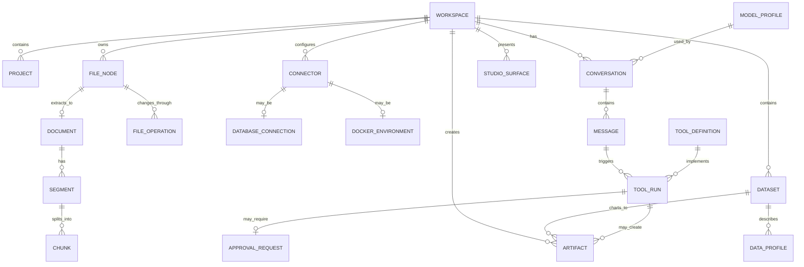

# Domain Model

## Current Implementation Note

The current repository implements the early local-first subset of this model. Workspaces are represented by a selected root path and a scanned `WorkspaceSnapshot`; file nodes are returned by `app/internal/workspace/scanner.go`; previews, searches, context packs, dataset profiles, artifacts, LLM settings, recent workspaces, agent tool descriptors, freshness checks, lineage, and chat history are implemented with Go structs and local JSON/provenance files. SQLite schema initialization, mirroring, direct fresh-row writes, metadata search, dataset dependency records, and SQL run history now exist; JSON remains the compatibility fallback while repository coverage expands.

The richer IDs below describe the intended durable domain model. Do not treat every listed field as a created database column yet.

## Main Concepts

### Workspace

A workspace is the top-level studio container for files, data sources, chats, tools, settings, and artifacts.

Examples:

- a code repository
- a marketing analysis folder
- a client reporting project
- a Docker Compose app
- a mixed business workspace with docs, spreadsheets, and dashboards

Fields:

- workspace ID
- display name
- root path
- workspace type
- created at
- updated at
- indexing status
- permissions policy
- default model profile
- artifact root

### Project

A project is an optional logical unit inside a workspace. In the UI it should behave like an IDE/data-studio scope: a folder, dataset collection, report package, or operational environment the user can work inside.

Examples:

- frontend app
- backend service
- marketing report
- traffic analysis
- Docker environment
- database investigation

Fields:

- project ID
- workspace ID
- name
- description
- root path or scope
- tags
- active conversation ID

### File Node

A file node represents a file or directory inside an approved workspace root.

Fields:

- path
- normalized path
- workspace ID
- kind: file or directory
- detected type
- size
- modified time
- content hash
- preview mode
- index status
- ignored flag

Current implementation:

- `workspace.FileNode` includes name, absolute path, workspace-relative path, kind, detected file type, depth, and display metadata.
- The scanner skips ignored/noisy folders, symlinks, overly deep trees, and oversized listings before the frontend sees them.

### Document

A document is an extracted representation of a file that can be read or summarized.

Examples:

- Markdown file
- PDF
- DOCX
- text file
- HTML file
- presentation
- image with OCR text

Fields:

- file node ID
- document type
- title
- language
- extracted text
- extraction status
- extraction errors
- source hash
- generated summary
- summary prompt version

### Segment

A segment is a meaningful block extracted from a document.

Examples:

- heading
- paragraph
- table
- code block
- image caption
- PDF page
- spreadsheet sheet
- log section

Fields:

- document ID
- segment index
- role
- label
- text
- page number or sheet name
- row and column range when relevant
- weight
- text hash

### Chunk

A chunk is the searchable unit used for retrieval and context building.

Fields:

- workspace ID
- document ID
- segment ID
- chunk index
- path
- language
- text
- text hash
- token estimate
- source type
- embedding vector, optional
- FTS vector, optional

### Dataset

A dataset is structured data that can be profiled, queried, summarized, and charted.

Examples:

- Excel sheet
- CSV file
- JSON table
- database query result
- GA4 export
- Search Console export
- server log table

Fields:

- dataset ID
- workspace ID
- source type
- source path or connector ID
- display name
- schema
- row count
- column count
- profile status
- DuckDB table name
- source hash

### Studio Surface

A studio surface is a durable product mode for a specific kind of work. It is not a separate app; it is a focused view over the same workspace, tool, model, and artifact system.

Current top-level surfaces:

- Workbench
- Data & Analytics
- Artifacts
- Settings

Roadmap capability domains such as analytics connectors, document intelligence, and operations tools can later become native surfaces if their workflows become deep enough.

Fields:

- surface ID
- workspace ID
- active project or scope
- active file, dataset, connector, or artifact
- open tabs
- selected context pack
- visible tools
- last activity

### Data Profile

A data profile describes a dataset for the user and the LLM.

Fields:

- dataset ID
- column names
- column types
- null counts
- distinct counts
- numeric summaries
- date ranges
- sample rows
- detected dimensions
- detected metrics
- warnings

### Connector

A connector is a configured link to an external system.

Examples:

- PostgreSQL
- MySQL
- DuckDB
- SQLite
- Docker Engine
- GA4
- Search Console
- Google Ads
- Meta Ads
- HTTP search provider

Fields:

- connector ID
- workspace ID
- type
- display name
- config JSON
- encrypted credentials reference
- read-only flag
- enabled flag
- last health check

Current foundation:

- Connector profile metadata is stored in local app config through `app/internal/storage/connector_profiles.go`.
- Password/token material is stored in a protected sidecar and the public profile JSON keeps only a credential reference.
- Profiles are returned to the frontend with redacted credential values.
- Profiles are read-only by default and include result caps plus timeout settings.
- PostgreSQL, MySQL/MariaDB, SQL Server, and DuckDB profiles can be explicitly tested and schema-inspected from Settings; protected credentials resolve only for that user-triggered action.
- DuckDB profile execution is available behind the `duckdb` build tag with CGO enabled; default builds validate profiles and return a clear setup error instead of silently attempting unavailable driver work.

### Database Connection

A database connection is a connector specialized for SQL systems.

Fields:

- connector ID
- driver
- host or path
- database name
- read-only mode
- allowed schemas
- blocked statements
- connection status

### Docker Environment

A Docker environment represents Docker state visible to Nexus Augentic Studio.

Fields:

- environment ID
- connector ID
- context name
- endpoint
- detected version
- containers
- images
- compose projects
- access mode
- last refresh time

### Model Profile

A model profile defines how Nexus Augentic Studio should call an LLM.

Fields:

- profile ID
- provider type
- base URL
- model name
- API key reference
- temperature
- max context tokens
- supports streaming
- supports tools
- supports vision
- supports image generation
- supports embeddings
- timeout settings

### Conversation

A conversation is a chat thread tied to a workspace or project.

Fields:

- conversation ID
- workspace ID
- project ID, optional
- title
- model profile ID
- created at
- updated at
- archived flag

### Message

A message stores user, assistant, system, or tool content.

Fields:

- message ID
- conversation ID
- role
- content
- structured content JSON
- source references
- created at
- token estimate

### Tool Definition

A tool definition describes a callable backend capability.

Fields:

- tool name
- description
- input schema
- output schema
- risk level
- approval policy
- timeout
- max output size
- enabled flag

### Tool Run

A tool run is one executed tool call.

Fields:

- tool run ID
- conversation ID
- message ID
- tool name
- input JSON
- output JSON
- status
- risk level
- approval ID
- duration
- error
- created at

### Approval Request

An approval request is a user decision point for risky actions.

Examples:

- write file
- overwrite file
- delete file
- run Docker build
- stop container
- run database mutation
- execute shell command

Fields:

- approval ID
- workspace ID
- conversation ID
- action type
- description
- input JSON
- diff or preview
- status: pending, approved, rejected, expired
- created at
- resolved at

### Artifact

An artifact is a generated or exported result.

Examples:

- Markdown report
- PDF report
- CSV export, first bounded dataset query export implemented
- PNG chart
- SVG chart, first deterministic CSV bar chart implemented
- SQL file
- generated source file
- Dockerfile
- docker-compose.yml
- cleaned Excel export
- HTML dashboard

Fields:

- artifact ID
- workspace ID
- conversation ID
- path
- kind
- title
- source tool run IDs
- created at
- source references
- content hash

### File Operation

A file operation is a deterministic backend action against a workspace-relative file path.

Examples:

- create file
- update file
- delete file
- rename file
- move file

Fields:

- operation type
- source relative path
- target relative path, when relevant
- action preview or diff
- size
- status
- message

Current implementation:

- create and update use `app/internal/workspace/write.go`
- delete uses `app/internal/workspace/delete.go`
- rename and move use `app/internal/workspace/move.go`
- all three reject traversal, metadata paths, symlinks, directories, and unsafe targets before applying
- creates and updates require a diff preview before apply
- deletes and moves require backend validation and frontend confirmation

### Dataset Chart

A dataset chart is a deterministic visualization artifact produced from a bounded dataset analysis.

Current implementation:

- `app/internal/workspace/chart.go` builds a first CSV bar or line chart model from one category column.
- The chart can count rows per category or sum a selected numeric column per category.
- The result is capped to bounded chart points before rendering.
- `app/internal/artifact/markdown_report.go` writes the chart as an SVG artifact under `.nexusdesk/artifacts/` with provenance metadata.

### Dataset Query Export

A dataset query export is a deterministic CSV artifact created from a bounded dataset query result.

Current implementation:

- `app/internal/workspace/dataset_query.go` returns bounded CSV rows for text search, `column=value` filters, numeric comparisons, `contains`, `limit`, and simple `order by` clauses.
- `app/internal/artifact/markdown_report.go` writes those bounded rows as a CSV artifact under `.nexusdesk/artifacts/`.
- The export writes a provenance sidecar with source path and query string.

### Workspace Scan Report

A workspace scan report is an auditable Markdown snapshot of the current indexing pass.

Current implementation:

- `app/internal/artifact/markdown_report.go` writes included, ignored, depth-skipped, entry-cap, unreadable, max-depth, and max-entry counters.
- Reports include skipped/ignored samples and are saved under `.nexusdesk/artifacts/` with sidecar metadata.

### Agent Runtime And Tool Descriptor

An agent runtime is the model-directed loop that can plan, request tools, receive observations, and produce a final answer. An agent tool descriptor is the registered shape of a deterministic backend capability available to that runtime and to explicit UI tool-plan actions.

Current implementation:

- `app/internal/agent/agent.go` runs a bounded ReAct loop, parses `Action: tool({...})` calls, normalizes visible plan steps, prunes working memory, and returns final answers with ordered tool-call observations.
- `app/agent_runtime.go` exposes `RunAgent` and `AgentSystemPrompt` through the Wails backend and maps tool calls to workspace-safe handlers.
- `app/internal/agenttools/registry.go` exposes tool names, titles, descriptions, studio surfaces, risk levels, approval requirements, and input names.
- The frontend uses these descriptors to show a proposed tool plan for the active workspace, dataset, artifact, or operations context.
- Dry-runs and explicit executions are persisted under `.nexusdesk/tool-runs/log.json` with inputs, output summary, risk, approval ID, timing, and errors.
- Model-directed writes and shell commands are blocked unless explicit high-impact approval is supplied to `RunAgent`; the visible frontend flow still prefers user-triggered preview/apply actions.

### SQLite Metadata Store

The SQLite metadata store is the durable app metadata path for current workspace history, while JSON remains the migration and compatibility fallback.

Current implementation:

- `app/internal/appmeta/` writes `.nexusdesk/metadata/schema.sql`, initializes `.nexusdesk/metadata/nexusdesk.sqlite` through `modernc.org/sqlite`, and writes a manifest with schema version/hash.
- The schema mirrors workspaces, chats, approvals, artifacts, and tool runs from the current JSON/provenance stores.
- Fresh chats, approvals, artifacts, and tool runs write directly to SQLite once the store exists, while JSON stores remain active compatibility writers/fallbacks.
- `InspectMetadataStore` returns table columns, row counts, sample rows, and dataset SQL view summaries for the workbench; the UI can select tables, filter columns, and copy row samples.
- Metadata search returns chat, artifact, and tool-run snippets for the workbench history surface.
- Dataset dependency and SQL run tables record saved SQL snippets, SQL artifacts, chart artifacts, summaries, and connector queries.

### Workspace SQLite Connector

The first database connector is scoped to workspace-local SQLite files.

Current implementation:

- `.sqlite`, `.sqlite3`, and `.db` files are classified as database files in the workspace tree.
- `app/internal/dbconnector/` opens those files read-only through `modernc.org/sqlite`.
- Only bounded `SELECT`/`WITH` queries are accepted, mutation-oriented keywords are blocked, and result rows are capped before they reach the frontend.
- Query requests carry an explicit request ID, result limit, and timeout; the dataset service can cancel an in-flight SQLite query by request ID.
- SQLite connector failures are passed through a redaction helper before they are recorded in SQL run metadata.
- The connector metadata model exposes connector identity, engine, read-only state, tables, views, columns, indexes, row counts, and capped samples.
- The Data & Analytics schema browser can select inspected SQLite tables/views, copy a safe `SELECT *` query into the editor, run an explicit capped row preview, show relationship hints from declared foreign keys and conservative `*_id` matches, ask the assistant to explain only the selected schema object, save SQLite connector queries as a separate query kind, and filter SQLite query history.
- SQLite connector query results can become CSV artifacts or Markdown reports; artifact metadata and SQL/dependency history cite the source database path, SQL text, engine, cap, timeout, and generated artifact.
- `InspectWorkspaceSQLite` is a user-triggered schema inspection path; folder open does not inspect database files.
- Data & Analytics can use this for local inspection without introducing stored credentials or external database access.

### External SQL Connector Profiles

The first external database connectors are scoped to saved PostgreSQL, MySQL/MariaDB, SQL Server, and DuckDB profiles.

Current implementation:

- `app/internal/dbconnector/` opens PostgreSQL profiles through `pgx`, MySQL/MariaDB profiles through `go-sql-driver/mysql`, SQL Server profiles through `go-mssqldb`, and DuckDB files through `duckdb-go` when the optional `duckdb` build tag and CGO toolchain are available.
- Test, inspect, and guarded query methods resolve protected credentials at execution time rather than when profiles are listed.
- Sessions are set read-only where supported and receive a statement timeout derived from the profile/request timeout.
- Only single-statement `SELECT`/`WITH` SQL is accepted for the guarded profile query path.
- Schema inspection returns non-system tables/views, columns, indexes, declared foreign keys, capped sample rows, provider row estimates/counts where available, and conservative `*_id` relationship hints.
- The current UI exposes Test and Inspect actions in Settings; full query notebook integration remains planned.

### Read-only Dataset SQL

Read-only dataset SQL is the first SQL-like analytics surface for CSV data.

Current implementation:

- `app/internal/analytics/` accepts a constrained `SELECT` subset, blocks mutation keywords, and executes through bounded CSV query primitives by default.
- A real DuckDB `database/sql` execution path registers the selected dataset as a `dataset` view when built with the `duckdb` tag on a CGO-enabled workstation.
- SQL result exports create Markdown artifacts with SQL text, engine, row counts, preview rows, and source dataset citations.
- SQL snippets are saved per dataset separately from lightweight row filters.

### Artifact Lineage

Artifact lineage links generated outputs back to chats, tool runs, and source files.

Current implementation:

- `GetArtifactLineage` builds a compact graph from artifact sidecar metadata, chat source paths, and `.nexusdesk/tool-runs/log.json`.
- The Artifact Studio route shows a selectable lineage graph, relationship counts, source/chat/tool/artifact filtering, and visible source navigation.
- Lineage can be exported as a JSON artifact and imported back as a preview for debugging, future sync, and graph comparison workflows.

### Workspace Freshness

Workspace freshness tracks whether source files changed after generated outputs were created.

Current implementation:

- `app/internal/workspace/freshness.go` snapshots file size and modification time by workspace-relative path.
- `CheckWorkspaceFreshness` compares snapshots, ignores internal metadata/tool-run paths, and marks generated artifacts stale when their provenance references changed source paths.
- Chat messages and context-pack previews warn when cited paths have changed.
- Data & Analytics clears visible query/chart/profile state when the selected dataset changes on disk, and freshness reports dataset-derived views/snippets/reports that should be refreshed.

### Artifact Comparison

Artifact comparison summarizes differences between generated outputs.

Current implementation:

- `app/internal/artifact.Compare` validates both artifact paths, reads sidecar metadata, reports title/kind/size delta, and returns bounded added/removed line summaries.

### Saved Dataset Query

A saved dataset query is a reusable Data & Analytics query tied to one workspace-relative dataset path.

Current implementation:

- `app/internal/dataset/query_history.go` stores recent saved queries in `.nexusdesk/datasets/queries.json`.
- Saved queries include label, query text, dataset path, query kind, and update time.
- Lightweight row filters and read-only SQL snippets are stored as separate query kinds.
- The store reuses rooted dataset path validation and caps saved queries per dataset.

### Dataset Summary

A dataset summary is a deterministic Markdown artifact generated from the bounded CSV table preview/profile.

Current implementation:

- `app/internal/artifact/markdown_report.go` writes source path, row/column counts, column profile table, and suggested questions.
- The summary is written under `.nexusdesk/artifacts/` with sidecar metadata like reports, charts, and query exports.

## Relationship Overview

## Design Rule

Store original source content and generated AI content separately.

Original files, extracted text, spreadsheet data, database results, and Docker logs should remain auditable. Summaries, insights, chart specs, generated reports, and model answers can be regenerated when prompts, models, or source data change.
