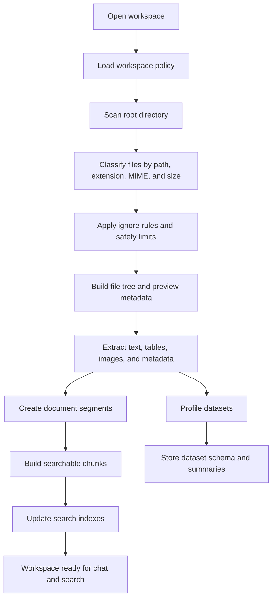

# Workspace And Indexing

## Goals

NexusDesk should understand a workspace without overwhelming the user or the model.

Indexing should gather enough structure to make files, documents, datasets, and artifacts searchable and useful, while avoiding unsafe or noisy content.

It should prefer:

- source code
- documentation
- configuration files
- Markdown and text files
- PDFs and office documents
- spreadsheets and CSV files
- images and screenshots
- SQL files and query outputs
- Dockerfiles and Compose files
- logs selected by the user
- generated artifacts

It should avoid by default:

- dependency directories such as `node_modules`
- build outputs such as `dist`, `build`, `target`, `.next`
- binary blobs without preview support
- large archives
- cache directories
- secrets files
- OS/system files
- hidden folders unless explicitly allowed
- very large logs unless selected or sampled

## Workspace Pipeline



## File Classification

Every file should be assigned a type and preview mode.

Example classes:

```text
code
text
markdown
json
yaml
sql
spreadsheet
csv
pdf
doc
presentation
image
log
docker
database
archive
binary
unknown
```

Preview modes:

```text
editor
read-only text
image viewer
PDF viewer
spreadsheet table
dataset profile
chart artifact
metadata only
unsupported
```

## Ignore Rules

NexusDesk should combine:

- global ignore rules
- workspace ignore rules
- `.gitignore` rules where useful
- explicit user exclusions
- secret-pattern exclusions

Recommended default ignored paths:

```text
.git/
node_modules/
vendor/
dist/
build/
target/
.next/
.cache/
coverage/
tmp/
*.lock when not useful for analysis
```

Lock files can be useful for dependency analysis, so the app should allow targeted inclusion.

## Extraction Pipeline

### Text And Code

For text and code files:

- detect encoding
- read within size limits
- preserve path, extension, and language
- build chunks by logical boundaries
- prefer heading, function, or block boundaries when possible
- keep line ranges for citations and patch previews

### Markdown

For Markdown:

- extract headings
- preserve lists and tables
- keep code blocks separate
- build a heading path for each chunk
- allow generated reports to use Markdown as default output

### PDF

For PDFs:

- render in UI with a PDF viewer
- extract text per page when possible
- store page numbers
- support OCR or vision fallback for scanned PDFs later
- avoid pretending a scanned document has text if extraction fails

### Images

For images:

- preview in UI
- store metadata
- optionally extract OCR text
- use vision model only when the selected model supports it
- reference image files explicitly in model calls

### Spreadsheets

For Excel and CSV:

- inspect workbook/sheet names
- detect headers
- count rows and columns
- sample rows
- infer column types
- profile missing values and numeric ranges
- optionally load tables into DuckDB
- never send whole large workbooks directly to the LLM

### Logs

For logs:

- detect timestamp patterns
- sample large logs
- support user-selected ranges
- extract error clusters when useful
- avoid indexing huge logs without limits

### Docker And Config Files

For Dockerfiles, Compose files, env samples, and config files:

- parse as text
- preserve indentation
- tag as operations-related
- highlight dangerous or privileged settings in analysis
- avoid exposing secrets

## Chunking

Chunks should be deterministic and traceable.

Recommended rules:

- keep chunk size below the model context target
- prefer splitting at headings, paragraphs, functions, rows, or pages
- keep overlap only where useful
- attach source metadata: path, line range, page number, sheet, or row range
- discard tiny fragments unless they contain unique metadata
- preserve source hashes

Future improvements:

- AST-aware code chunking
- PDF layout-aware chunking
- spreadsheet semantic regions
- image OCR bounding boxes
- log event clustering
- embeddings for semantic search

## Dataset Profiling

A dataset profile should include:

- source file or connector
- table/sheet name
- row count
- column count
- column names
- inferred types
- missing values
- distinct counts
- numeric min, max, average
- date ranges
- sample rows
- warnings for suspicious data

This gives the LLM a compact, accurate view of the data without loading everything into the prompt.

## Incremental Indexing

Use hashes to avoid reprocessing unchanged files:

- file content hash
- extracted text hash
- chunk hash
- dataset schema hash
- profile hash

When content changes:

- update file metadata
- replace extracted document text
- replace affected chunks
- clear stale summaries
- refresh dataset profile
- refresh search index
- mark related conversations as using stale context if needed

## Workspace Watcher

A file watcher can update the index when files change.

Rules:

- debounce rapid changes
- ignore temporary editor files
- pause indexing during large workspace operations
- show indexing status in the UI
- allow manual reindex

## Index Run Reporting

Every indexing run should record:

- workspace ID
- start/end time
- files discovered
- files indexed
- files skipped
- files failed
- datasets profiled
- chunks created
- artifacts detected
- average extraction latency
- top error types
- ignored path examples

Indexing trust matters. A successful index run is not just “finished”; it should explain what was included and what was skipped.
