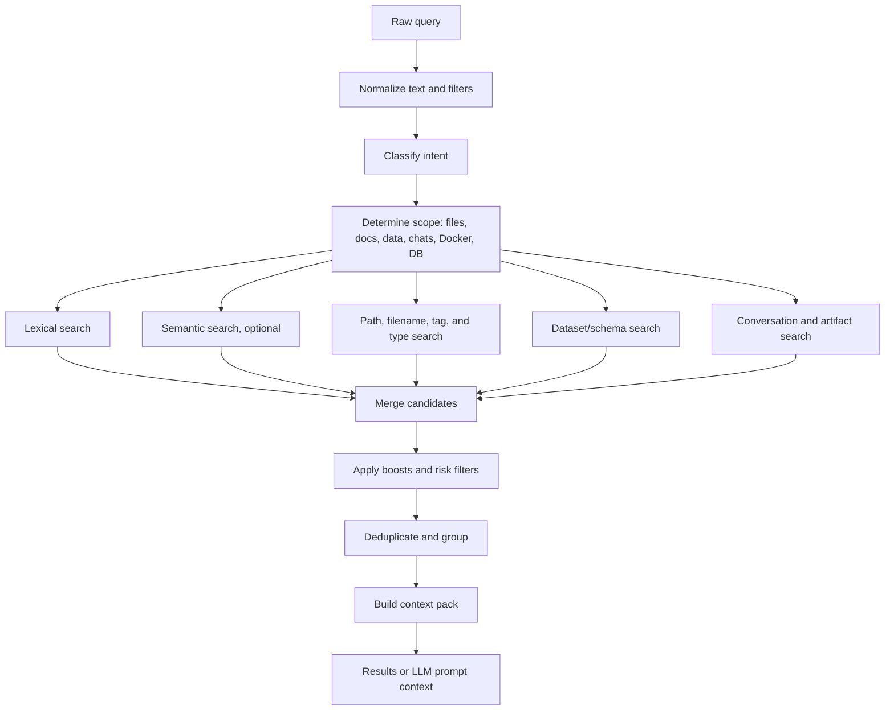

# Search, Context, And Ranking

## Search Philosophy

NexusDesk should return useful workspace context quickly and let AI synthesis happen separately.

Search should serve the whole studio, not only chat. The same retrieval layer should power project navigation, IDE-style symbol/file lookup, dataset discovery, artifact discovery, and analytics questions.

Search is used by:

- the user in the UI
- the chat agent
- file picker suggestions
- studio navigation and quick-open flows
- context builder
- report generation
- artifact discovery
- debugging and evaluation

The LLM should not receive the whole workspace. It should receive a compact context pack built from ranked, explainable sources.

## Query Pipeline



## Intent Types

NexusDesk should detect broad intent classes:

```text
code_question
document_question
spreadsheet_analysis
marketing_analysis
database_question
docker_question
file_search
artifact_request
report_request
image_question
general_chat
```

Intent detection should be helpful but not magical. Users can override scope by selecting files, folders, datasets, or connectors.

## Retrieval Sources

### File Name And Path

Good for:

- finding specific files
- matching extensions
- locating Dockerfiles, Compose files, README files, and reports
- navigating known project areas

### Full Text

Good for:

- exact terms
- code identifiers
- function names
- document phrases
- SQL table names
- campaign names
- log messages

### Semantic Search

Good for:

- concept matches
- paraphrased questions
- document analysis
- business questions
- marketing and traffic themes

Semantic search should be optional in early versions. The system should still work with filename and full-text retrieval.

### Dataset And Schema Search

Good for:

- column names
- table names
- sheet names
- metric names
- date ranges
- data source names

This helps the agent answer questions like:

```text
Which file has conversion rate by campaign?
Where is the traffic source data?
Which database table stores orders?
```

### Conversation Search

Good for:

- continuing previous analysis
- finding prior decisions
- reusing generated reports
- locating earlier tool results

Conversation search should respect workspace boundaries.

### Artifact Search

Good for:

- generated charts
- generated reports
- exported files
- generated code and configs
- previous analysis outputs

Artifacts should have metadata linking them to their source files, tool runs, and conversations.

## Ranking

Recommended first-stage candidate score:

```text
score += source_weight / (rrf_k + source_rank)
```

Then apply deterministic boosts:

- selected file boost
- open tab boost
- current folder boost
- recent file boost
- exact filename boost
- exact symbol/identifier boost
- heading match boost
- dataset schema boost
- artifact recency boost
- user-pinned item boost
- source type boost
- trusted connector boost

Then apply filters:

- workspace boundary
- ignored paths
- secret files
- binary/unsupported files
- risk policy
- file size caps
- stale context warnings

## Context Pack

A context pack is the structured bundle sent to the LLM.

It should include:

- user question
- current workspace and project
- current studio surface
- selected files or datasets
- top ranked sources
- source excerpts
- data profiles
- tool results
- artifact references
- constraints and policies

Example shape:

```json
{
  "workspace": "Client Traffic Analysis",
  "question": "Which campaign had the best conversion rate?",
  "sources": [
    {
      "type": "dataset_profile",
      "id": "dataset:campaign_export",
      "path": "data/campaigns.xlsx",
      "sheet": "Campaigns",
      "summary": "1,240 rows, columns: campaign, channel, clicks, conversions, revenue"
    },
    {
      "type": "chunk",
      "path": "notes/marketing_goals.md",
      "line_range": "12-38",
      "text": "..."
    }
  ]
}
```

## Source References

Answers should cite source references in a product-friendly way:

```text
Source: data/campaigns.xlsx / Campaigns sheet / rows 1-1240
Source: reports/seo_notes.pdf / page 3
Source: src/api/orders.go / lines 44-91
Source: Docker container logs / api / last 500 lines
```

Do not cite vague internal IDs to the user unless in debug mode.

## Ranking Explainability

Every search result should expose debug data for internal/dev mode:

- final score
- matched fields
- source type
- source ranks
- boosts applied
- filters applied
- reason for exclusion
- chunk metadata
- stale status
- dataset profile version
- artifact source chain

This is how NexusDesk remains trustworthy as the indexing and agent system grow.

## Context Limits

The context builder must protect model calls:

- cap number of sources
- cap excerpt length
- summarize long documents before use
- use dataset profiles instead of raw large data
- ask tools for specific ranges when needed
- avoid sending secrets
- avoid sending unrelated workspace content

If the model needs more context, it should ask for a specific tool call.

## Evaluation Set

NexusDesk needs a permanent evaluation set:

- code questions
- document questions
- spreadsheet questions
- marketing report questions
- image questions
- Docker questions
- database schema questions
- ambiguous workspace questions
- risky action requests
- weak-context questions

Every search and ranking change should be replayed against this set.
