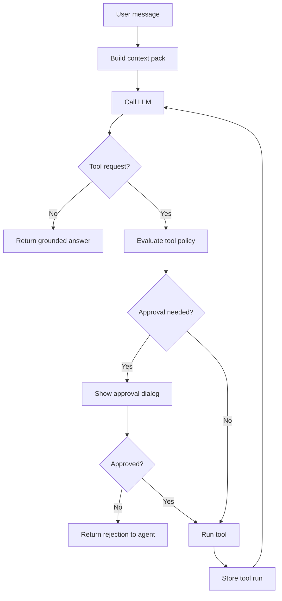

# AI Agent And LLM Strategy

## AI Role

AI in NexusDesk should behave like an integrated studio assistant inside an IDE/data/analytics environment. It should help users understand and act on workspace information, but it should not bypass retrieval, permissions, or source control.

Good uses:

- explaining code and documents
- summarizing selected files
- analyzing spreadsheets and datasets
- creating charts and reports
- generating code and config drafts
- translating user intent into safe tool requests
- summarizing Docker logs
- writing SQL suggestions
- creating grounded business insights
- comparing documents or datasets

Risky uses:

- answering from model memory when workspace sources are needed
- silently editing files
- silently running commands
- silently querying sensitive databases
- inventing metrics or citations
- treating a weak source match as proof
- performing Docker or database mutations without approval

## Model Gateway

All model calls should go through one gateway interface.

Responsibilities:

- route to configured model provider
- normalize chat request/response formats
- support streaming when available
- support capability flags
- enforce timeouts
- enforce max context size
- redact blocked content when policy requires it
- log latency, model, and errors
- support model A/B tests
- support prompt versioning

Initial provider types:

```text
ollama_native
openai_compatible
docker_model_runner
custom_http
```

## LLM Settings

Users should be able to configure:

```json
{
  "provider": "openai_compatible",
  "baseUrl": "http://localhost:11434/v1",
  "apiKey": "",
  "model": "qwen2.5-coder:7b",
  "temperature": 0.2,
  "maxContextTokens": 32000,
  "supportsStreaming": true,
  "supportsTools": false,
  "supportsVision": false,
  "supportsImageGeneration": false,
  "supportsEmbeddings": true
}
```

The settings UI should offer a short recommended-model dropdown for local Ollama-style providers while preserving the same stored model string used by custom OpenAI-compatible endpoints. The current recommended set intentionally stays at 26B parameters or below:

```text
qwen3:4b-instruct
qwen3:8b
qwen3.5:9b
phi4:14b
phi4-reasoning:14b
gpt-oss:20b
mistral-small3.2:latest
gemma4:26b
```

Capabilities should be explicit. The app should not assume every model supports tool calling, vision, embeddings, or image generation.

Current implementation:

- `app/internal/storage/llm_settings.go` stores provider name, base URL, and model in local JSON config.
- Saved API keys are stored in a sidecar credential blob protected by the OS where available and are redacted before settings are returned to the frontend.
- When the frontend sends the redacted API key marker back, the backend resolves the stored secret only for save/test flows that need it.
- The frontend settings card exposes a curated local model dropdown capped at 26B parameters.
- `app/internal/llm/probe.go` tests OpenAI-compatible `/models` endpoints.
- The probe returns model count, a small model sample, capability hints, and configured-model warnings.
- `app/internal/llm/chat.go` sends OpenAI-compatible `/chat/completions` requests, including streaming responses through server-sent `data:` chunks.
- `AskLLM` and `AskLLMStream` in `app/app.go` resolve saved settings and attach selected workspace text context server-side.
- `AskLLMContextPack` and `AskLLMStreamContextPack` build a bounded multi-file context pack from pinned previews.
- Directory and project context use `app/internal/workspace/context.go` to expand selected folders or `.` into a capped list of previewable files before the streaming chat request is sent.
- Workspace search and CSV row queries are deterministic backend tools, not model-side file access.
- `AskLLMStream` emits `nexusdesk:chat-stream` Wails events so the frontend can render partial assistant responses before final history persistence completes.
- `app/internal/storage/chat_history.go` persists bounded chat history per workspace in local JSON config.
- The local workstation endpoint is backed by the sibling `../Llm/` Compose stack. Its `rcooler-ollama` container must use `OLLAMA_LLM_LIBRARY=cuda_v12`; otherwise Ollama may select CUDA 13, fail GPU initialization, and fall back to CPU with zero VRAM offload.

Capability hints are currently inferred from model IDs. They are useful for readiness signals, but they are not a substitute for provider-native capability metadata.

The current chat implementation requires an explicit configured model. It includes either a bounded selected text preview or a bounded pinned context pack, sends selected CSV files as a structured column profile plus bounded row sample, sends DOCX text and extracted PDF text when available, and streams response text when the configured provider supports OpenAI-compatible streaming. Directory and project context are bounded expansions, not raw full-project dumps: ignored folders, symlinks, images, binaries, and oversized content are skipped, and the included files/bytes are capped. The Explain action uses the same selected text/code/document/directory boundary to send a deterministic explanation prompt. It does not yet run a model-directed tool loop.

## Agent Modes

NexusDesk can expose several modes while using the same underlying agent loop.

These modes should map to visible studio surfaces. The user should feel they are working in Code Studio, Data Studio, Analytics Studio, Document Studio, or Operations Studio, with AI available as one command layer inside that surface.

### General Workspace Assistant

Good for:

- general questions
- file navigation
- summarization
- asking what is inside a workspace

### Code Assistant

Good for:

- code explanation
- file generation
- bug review
- patch proposals
- dependency analysis
- Dockerfile and Compose creation

### Data Analyst

Good for:

- Excel and CSV analysis
- DuckDB queries
- chart generation
- report writing
- metric interpretation

### Analytics Studio

Good for:

- multi-source analysis
- marketing reports
- funnel and campaign interpretation
- chart and dashboard creation
- artifact-backed conclusions

### Marketing Analyst

Good for:

- campaign exports
- SEO data
- traffic source analysis
- landing page screenshots
- funnel reports
- UTM analysis

### Operations Assistant

Good for:

- Docker inspection
- container logs
- Compose explanation
- environment analysis
- safe troubleshooting steps

## Tool Calling

If the selected provider supports native tool calling, NexusDesk can use the provider’s tool format.

If not, NexusDesk can use a controlled JSON request format:

```json
{
  "tool": "read_file",
  "args": {
    "path": "README.md"
  }
}
```

The app must validate:

- tool name exists
- arguments match schema
- tool is enabled
- path is inside workspace
- risk level is allowed
- approval is present when required

The model should never receive raw authority to perform actions.

## Tool Risk Levels

### Low Risk

Examples:

- list directory
- read approved file
- inspect spreadsheet
- profile dataset
- search workspace
- read Docker logs
- render chart preview

Default behavior: allowed after workspace permission.

### Medium Risk

Examples:

- create new file
- write report artifact
- query database read-only
- fetch external URL
- connect to configured API

Default behavior: show tool call in chat and allow policy-based confirmation.

### High Risk

Examples:

- overwrite file
- delete file
- edit code
- run Docker build
- start/stop container
- execute shell command
- mutate database
- send many files to remote model

Default behavior: require explicit approval with preview or diff.

## Agent Loop



Loop limits:

- max tool calls per turn
- max time per turn
- max output size per tool
- max retries after tool failure
- stop if the model repeats the same failed action

Current implementation:

- one user prompt maps to one non-streaming provider request
- no tool loop is active yet
- selected file context is read through the same rooted preview boundary as the source preview pane
- chat history is persisted per workspace in local JSON config
- file create/update/delete/rename/move actions are deterministic UI-triggered tools today, not model-directed tool calls
- first CSV chart artifacts are deterministic UI-triggered tools today, not model-directed chart rendering

## Prompt Contracts

The prompt should give the model:

- user request
- workspace summary
- selected files, pinned context packs, or datasets
- top context sources
- allowed tools
- tool schema
- policy rules
- answer style
- citation requirements
- artifact rules

The prompt should tell the model:

- do not claim access to files not provided or retrieved
- request tools when more context is needed
- cite files, sheets, rows, pages, or logs used
- create artifacts only through tools
- do not ask for dangerous actions when safe alternatives exist

## Excel And Data Analysis Contract

For spreadsheets and datasets, the model should work with structured summaries first:

- workbook/sheet names
- headers
- row counts
- column profiles
- sample rows
- detected metrics and dimensions

The model can request specific actions:

```json
{
  "tool": "query_dataset",
  "args": {
    "dataset": "campaigns",
    "sql": "select channel, sum(conversions) as conversions from campaigns group by channel"
  }
}
```

The backend should validate SQL, execute it through DuckDB or read-only connector logic, and return a limited result set.

## Chart Contract

The model should create chart specs, not pixels. The current app has a first deterministic CSV chart path that creates a bar-chart SVG from category counts or numeric sums without asking the model to draw or execute arbitrary code.

Example:

```json
{
  "type": "bar",
  "title": "Conversions by Channel",
  "x": ["Organic", "Paid Search", "Email"],
  "y": [420, 310, 185],
  "output": "artifacts/charts/conversions_by_channel.png"
}
```

The app validates the spec, renders the chart, stores the artifact, and returns a link/reference to the conversation.

## Image Strategy

For image files:

- preview locally in the UI
- send image to model only when the model supports vision and the user permits it
- use OCR first when the question is about text in an image
- use vision for screenshots, charts, layouts, ads, and UI reviews
- cite the image file path in the response

Image generation should be optional and provider-dependent.

## Memory And Caching

Cache:

- document summaries
- dataset profiles
- conversation context packs
- model responses when useful
- chart specs
- tool outputs that are safe to reuse

Cache keys should include:

- workspace ID
- source hashes
- model profile ID
- prompt version
- tool version

When a source changes, related cached insights should be marked stale.

## Safety

NexusDesk should enforce:

- no hidden file writes
- no silent destructive actions
- no model access outside allowed roots
- no secret files sent to remote models by default
- no database writes without explicit approval
- no Docker destructive actions without explicit approval
- no shell execution by default
- no arbitrary HTML rendering from model output

The model may suggest. NexusDesk decides what can happen.
