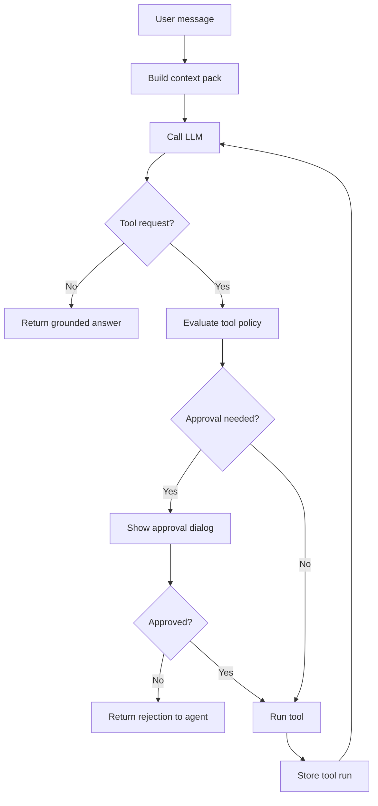

# AI Agent And LLM Strategy

## AI Role

AI in Nexus Augentic Studio should behave like an integrated studio assistant inside an IDE/data/analytics environment. It should help users understand and act on workspace information, but it should not bypass retrieval, permissions, or source control.

Good uses:

- explaining code and documents
- summarizing selected files
- analyzing spreadsheets and datasets
- creating charts and reports
- generating code and config drafts
- translating user intent into safe tool requests
- summarizing Docker logs
- writing SQL suggestions
- creating grounded business insights
- comparing documents or datasets

Risky uses:

- answering from model memory when workspace sources are needed
- silently editing files
- silently running commands
- silently querying sensitive databases
- inventing metrics or citations
- treating a weak source match as proof
- performing Docker or database mutations without approval

## Model Gateway

All model calls should go through one gateway interface.

Responsibilities:

- route to configured model provider
- normalize chat request/response formats
- support streaming when available
- support capability flags
- enforce timeouts
- enforce max context size
- redact blocked content when policy requires it
- log latency, model, and errors
- support model A/B tests
- support prompt versioning

Initial provider types:

```text
ollama_native
openai_compatible
docker_model_runner
custom_http
```

## LLM Settings

Users should be able to configure:

```json
{
  "provider": "openai_compatible",
  "protocol": "openai-compatible",
  "baseUrl": "http://localhost:11434/v1",
  "apiKey": "",
  "model": "qwen2.5-coder:7b",
  "temperature": 0.2,
  "maxContextTokens": 32000,
  "supportsStreaming": true,
  "supportsTools": false,
  "supportsVision": false,
  "supportsImageGeneration": false,
  "supportsEmbeddings": true
}
```

The settings UI should offer a recommended-model dropdown for local Ollama-style providers while preserving the same stored model string used by custom OpenAI-compatible endpoints. The catalog should include compact defaults for smaller machines and larger task-specific presets for production workstations:

```text
qwen3:4b-instruct
qwen3:8b
qwen3.5:9b
phi4:14b
phi4-reasoning:14b
gpt-oss:20b
mistral-small3.2:latest
gemma4:26b
qwen3-coder:30b
gemma4:31b
qwen3.6:27b
```

Capabilities should be explicit. The app should not assume every model supports tool calling, vision, embeddings, or image generation.

### Task-Aware Model Routing

NexusDesk should let users configure different default models for different app tasks instead of using one global model for every workflow. The first production implementation should be a Settings surface for "Model Routing" or "Task Model Defaults" that remains fully user-editable and provider-agnostic.

Important behavior:

- A global default model remains available as the fallback.
- Each task route can override provider, model, context tokens, response reserve, and capability expectations. Temperature remains a future route field when generation controls become user-facing.
- The app should probe whether a configured local model is installed/loaded and show warnings before a workflow starts.
- If a route model is unavailable, the app should ask whether to use the global fallback rather than silently switching.
- Saved chat answers, artifacts, agent runs, and audit records should store the resolved task route and model used.
- Vision/image routes must be gated by explicit capability flags and user consent before sending screenshots or images.

Initial recommended routing presets:

| Task | Suggested default model |
| --- | --- |
| Main coding model | `qwen3-coder:30b` |
| React / TypeScript / JavaScript | `qwen3-coder:30b` |
| Golang backend | `qwen3-coder:30b` |
| Python coding | `qwen3-coder:30b` |
| PHP / Laravel | `qwen3-coder:30b` |
| MySQL / PostgreSQL | `qwen3-coder:30b` |
| Neo4j / Cypher | `qwen3-coder:30b` |
| CSV / Excel data scripts | `qwen3-coder:30b` |
| Analytics explanations | `gemma4:31b` |
| Research / summaries | `gemma4:31b` |
| Image / screenshot understanding | `gemma4:31b` or `qwen3.6:27b` |
| Balanced coding + reasoning + vision | `qwen3.6:27b` |
| Fastest practical 30B-class coding model | `qwen3-coder:30b` |

The routing engine should map app surfaces to these task defaults:

- editor/code actions use coding routes;
- Git diff summaries and commit drafts use coding or review routes;
- Data Studio SQL/data-script generation uses coding/data routes;
- analytics explanations and report narratives use analytics/research routes;
- document and research summaries use research routes;
- screenshot/image understanding uses a vision route only when available and approved;
- agent mode resolves a route per step when the planned action changes domain, but should keep the route visible in audit logs.

Current native implementation:

- `nexus-app/internal/services/settings` stores non-secret provider, explicit protocol, global model, context-window, response-reserve settings, persisted task-aware model routes, and the curated local model catalog used by the Fyne Settings UI.
- Fyne Settings exposes the first Task route selector/editor so users can save different defaults for coding, backend, database, analytics, research, vision/screenshot, balanced reasoning, and fast-coding routes.
- `nexus-app/internal/services/assistant` accepts an optional model route ID, resolves it through Settings, returns route metadata/warnings, and keeps the global model as fallback when a requested route is missing.
- Ask mode exposes a model-route selector with a global fallback option; selected routes flow through the assistant service and appear in answer footers/artifact metadata.
- Git AI diff summaries and commit-message drafts request the main coding route, and saved `chat-answer` artifacts preserve resolved model-route metadata when present. Agent/Data/document/vision route selection remains deliberately staged.
- Windows protected secret persistence and assistant memory/profile parity are native; macOS/Linux keychains and richer assistant diagnostics remain follow-up work.
- `nexus-app/internal/services/llm` implements protocol-flagged OpenAI-compatible chat/completions, streaming SSE parsing, `/models` probing, Ollama `/api/ps` runtime diagnostics, loaded-model context-window tuning, response reserve, and workspace-context sentinel escaping.
- `nexus-app/internal/services/assistant` wraps the LLM client for Ask mode and attaches bounded selected-file, directory, project-root, and generated-artifact context packs.
- `nexus-app/internal/services/agent` owns the native ReAct-style agent loop with plan updates, bounded observations, model-driven tool calls, an emergency backend loop guard, and final-answer behavior.
- `nexus-app/internal/services/tools` owns the native deterministic tool dispatcher for context, file preview/search/problems, Git status/diff, tasks, rollbacks, approvals, safe file mutations, artifacts, documents, operations files, datasets, SQLite, and approval-gated web text fetches.
- Persistent workspace changes are treated as a trust boundary: write, append, copy, move, delete, rollback, and patch tools require scoped full-project access and still route through workspace services that enforce rooted paths, `.nexusdesk` guards, exact patch matching, rollback snapshots, and audit records.
- The Fyne assistant panel owns only prompt composition, context-pin controls, compact recent-history display, the compact live activity tail, final-answer replacement, and read-only audit rendering.
- Durable chat, agent, tool-run, approval, artifact, SQL, dataset dependency, and job records live in native SQLite metadata where available, with Wails-era import compatibility on workspace open.
- The local workstation endpoint can still target the sibling `../Llm/` Compose stack and `rcooler-ollama`, but native provider diagnostics should remain optional and user-triggered.

Capability hints are currently inferred from model IDs. They are useful for readiness signals, but they are not a substitute for provider-native capability metadata.

The current chat implementation requires an explicit configured model. It includes either a bounded selected text preview or a bounded pinned context pack, sends selected CSV files as a structured column profile plus bounded row sample, sends DOCX text and extracted PDF text when available, cites the source paths attached to persisted assistant answers, and streams response text when the configured provider supports OpenAI-compatible streaming. Directory and project context are bounded expansions, not raw full-project dumps: ignored folders, symlinks, images, binaries, and oversized content are skipped, and the included files/bytes are capped by the configured model window after reserving response/overhead space. The Activity Log records request, context budget, first-token, completion, failure, model-step, tool-step, and bounded-agent stop events so slow local model runs remain observable. The Explain action uses the same selected text/code/document/directory boundary to send a deterministic explanation prompt. `RunAgent` emits `nexus:agent-run` events while the bounded backend loop is running; the chat placeholder shows only the last one or two model/tool activity messages until the final answer replaces it.

The bottom Git drawer can ask the assistant for a diff summary or commit-message draft from the selected staged/unstaged diff. These actions send bounded diff text through the same chat path and are intentionally read-only: they do not stage, unstage, revert, commit, or mutate repository state.

## Agent Modes

Nexus Augentic Studio can expose several modes while using the same underlying agent loop.

These modes should map to the visible product surfaces. The user should feel they are working in Workbench, Data & Analytics, Artifacts, or Settings, with AI available as one command layer inside that surface. Analytics, document, and operations capabilities remain contextual domains until they justify native screens.

### General Workspace Assistant

Good for:

- general questions
- file navigation
- summarization
- asking what is inside a workspace
- choosing the right studio and tool for the task
- explaining what context is loaded and what evidence is missing

### Code Assistant

Good for:

- code explanation
- file generation
- bug review
- patch proposals
- dependency analysis
- Dockerfile and Compose creation
- git diff review
- test generation
- commit message and PR summary drafting
- symbol-aware navigation through native outline/go-to-symbol today, with deeper language services when available

### Data Analyst

Good for:

- Excel and CSV analysis
- DuckDB queries
- database schema exploration
- read-only SQL over configured connectors
- SQL dump import planning
- temporary database sandbox research
- chart generation
- report writing
- metric interpretation

### Analytics Capabilities

Good for:

- multi-source analysis
- marketing reports
- funnel and campaign interpretation
- GA4, Search Console, ads, CRM, Eloqua, and Mautic connector runs
- exported marketing and CRM data normalization
- chart and dashboard creation
- artifact-backed conclusions

### Marketing Analyst

Good for:

- campaign exports
- SEO data
- traffic source analysis
- landing page screenshots
- funnel reports
- UTM analysis
- lead quality and CRM handoff analysis
- paid media performance explanations

### Operations Assistant

Good for:

- Docker inspection
- container logs
- Compose explanation
- environment analysis
- safe troubleshooting steps
- port/process/service checks where policy allows
- generated runbooks and health checks
- command plan previews for start/stop/build/exec actions

### Document Analyst

Good for:

- PDF, DOCX, Markdown, TXT, spreadsheet, and presentation analysis
- document-set summaries
- extraction of decisions, risks, entities, dates, and action items
- document comparison and contradiction checks
- source-cited briefs, reports, and generated presentations

## AI Assistant Product Contract

The AI Assistant is not just the right sidebar chat. It should become the shared intelligence layer across all studios.

Responsibilities:

- maintain explicit context packs from files, folders, git diffs, documents, database schemas, query results, analytics connector runs, logs, and artifacts
- expose model/provider selection, context-window budget, response reserve, capability hints, GPU/local runner diagnostics, and streaming/tool-call status
- offer agent modes such as Ask, Plan, Review, Edit, Research, Analyze, Debug Ops, Generate Artifact, and Report Builder
- show proposed tool calls before execution with target, inputs, risk, approval requirement, expected output, and dry-run result
- cite every substantive answer with files, pages, rows, queries, connector runs, logs, or tool outputs
- keep lightweight workspace memory for accepted facts, decisions, preferred report formats, ignored paths, and reusable prompts
- warn when cited source files, data extracts, connector runs, or logs are stale
- create artifacts rather than leaving valuable work trapped in chat

Quality bar:

- ask for missing context instead of inventing it
- separate observed facts from inference
- mark weak evidence
- make it easy to retry with another model or compare outputs

Current UI note: the assistant header can retry the latest answered prompt or compare the latest answer against a fresh answer from the currently selected model/settings. Both actions reuse the answer's attached source paths when available, so comparisons remain grounded in the same context boundary instead of silently switching sources.
- preserve auditability for every tool-mediated action

## Tool Calling

If the selected provider supports native tool calling, Nexus Augentic Studio can use the provider’s tool format.

If not, Nexus Augentic Studio can use a controlled JSON request format:

```json
{
  "tool": "read_file",
  "args": {
    "path": "README.md"
  }
}
```

The app must validate:

- tool name exists
- arguments match schema
- tool is enabled
- path is inside workspace
- risk level is allowed
- approval is present when required

The model should never receive raw authority to perform actions.

## Tool Capability Matrix

Nexus should target Codex-class local workbench capability first, then go beyond Codex for data, documents, analytics, and operations. The executable tool registry must only expose tools that are actually implemented; planned tools belong in this matrix, `docs/27_AGENT_TOOL_REGISTRY.md`, and tracker until their backend validation, approval policy, audit logging, and UI affordances exist.

| Capability family | Current state | Target |
| --- | --- | --- |
| Plan/state | `update_plan`, live model/tool events, tool-run audit, explicit approval-request records | resumable runs, checkpoints, cancelled/resumed jobs, evaluation traces |
| Workspace discovery | list directory, preview file, path/text search, chat and agent-readable context packs, changed-file context, lightweight Problems context | ranked project map, semantic/symbol index, dependency graph, project memory |
| File mutation | text/code write, binary write, append, patch-native multi-file text edits, copy, move/rename, delete, bounded rollback snapshots and approval-gated restore/remove | conflict-aware merge assistance, generated file trees |
| Shell/tasks | discovered task listing, approval-gated task runner, and first-party approved terminal command tool using executable name plus explicit JSON args inside the workspace | richer task graph, long-running process supervision, interactive terminal sessions, command approval policy presets |
| Git | status, file diff, agent-readable diff context, changed-file previews, read-only history/blame context, hunk/file stage/unstage, branch creation, staged-change commits, rollback-backed conflict-marker resolution, rollback-backed discard for unstaged tracked changes and explicit untracked deletion, assistant summaries | staged reset/discard, commit-level revert/cherry-pick, and PR drafting/creation through connectors |
| Data | agent-readable CSV/TSV/JSON/NDJSON/XLSX/Parquet/log profiles, bounded row queries, read-only dataset SQL, and read-only SQLite schema/query context | dump import, temporary DB sandboxes, joins across files/connectors, data quality checks |
| Documents | agent-readable Markdown/TXT/PDF/DOCX/HTML/XML document-set context, text/Markdown/PDF/DOCX extraction, and reports | DOCX/PPTX generation, redline/comment workflows, OCR, document comparison, presentation synthesis |
| Artifacts | list/read artifacts, agent-readable lineage graph context, create Markdown reports, archive artifacts | artifact comparison/rebuild actions, export bundles |
| Browser/web | approval-gated HTTP(S) text fetch with redirect, size, content-type, local-network, and optional domain allow-list guards | browser automation, screenshots, network capture, richer page extraction, cached/source-attributed web research |
| Images/media | image/PDF preview, binary writes | image generation/editing, OCR, thumbnails, media metadata, visual regression diffing |
| Connectors/MCP | connector profiles and read-only DB workflows | MCP servers, GitHub/Jira/GA4/ads/CRM connectors, permissioned connector tool registry |
| External coding agents | detection-only readiness for `codex`, `claude` (Claude Code), and `opencode`; available through Diagnostics, first-run readiness, the low-risk `list_external_agent_tools` agent tool, and non-executing `plan_external_agent_run` contracts | optional future orchestration after NexusDesk's own file, Git, terminal, browser, connector, and artifact tools are complete; any launch path must have sandboxing, redaction, cancellation, audit, prompt/permission policy, output/artifact capture, and explicit user consent |
| Automation | not implemented | scheduled runs, monitors, reminders, background jobs, notifications |
| Ops/Docker | agent-readable read-only operations file inspection with env-secret redaction, constrained Docker shell subcommands | compose lifecycle, logs, health checks, exec/build controls, runbook generation |

Codex/Claude/OpenCode-parity means NexusDesk should expose its own first-party LLM toolbelt: files, Git, terminal commands, browser/web access, approvals, artifacts, jobs, connectors, and diagnostics. The low-risk `list_tool_catalog` tool exposes implemented and planned first-party tools to the agent so unavailable capabilities are visible as roadmap contracts instead of hallucinated executable tools. External coding-agent CLIs are optional integrations, not the primary capability surface. First-party security primitives now let the agent redact text, inspect approval posture, and record explicit future-approval requests before proposing multi-step risky work. Remaining parity gaps include staged/commit-level destructive Git policy, richer terminal sessions, browser automation, GitHub/PR operations, plugin/MCP discovery, image/document generation, and automation scheduling. Nexus-specific extensions should include database sandboxing, analytics connectors, document intelligence, and operations runbooks.

## Tool Risk Levels

### Low Risk

Examples:

- list directory
- read approved file
- inspect spreadsheet
- profile dataset
- search workspace
- read Docker logs
- render chart preview

Default behavior: allowed after workspace permission.

### Medium Risk

Examples:

- create new file
- write report artifact
- query database read-only
- fetch external URL
- connect to configured API

Default behavior: show tool call in chat and allow policy-based confirmation.

### High Risk

Examples:

- overwrite file
- delete file
- edit code
- run Docker build
- start/stop container
- execute shell command
- mutate database
- send many files to remote model

Default behavior: require explicit approval with preview or diff.

## Agent Loop



Loop limits:

- max tool calls per turn
- max time per turn
- max output size per tool
- max retries after tool failure
- stop if the model repeats the same failed action

Current implementation:

- normal chat still maps one user prompt/context pack to provider calls, with optional streaming
- `RunAgent` executes a bounded ReAct loop with plan updates, tool calls, observations, context pruning, and final-answer extraction
- registered agent tools can be executed through the loop and persisted as tool-run records
- JSON action parsing preserves nested object/array arguments as JSON strings so structured tool inputs do not collapse into Go map formatting
- direct executable agent tools include tool-catalog inspection, directory listing, bounded file reads, workspace search, bounded directory/project context packs, changed-file previews, bounded git status/diff/history/blame context, approval-gated Git index stage/unstage for files and hunks, approval-gated commits from already-staged changes, approval-gated branch creation with optional checkout, approval-gated rollback-backed conflict-marker resolution, approval-gated rollback-backed discard for unstaged tracked changes or explicit untracked-file deletion, lightweight Problems scanning, dataset profile/query/SELECT-only SQL, approval-gated dataset chart artifacts, workspace SQLite schema/query, document extraction, read-only operations scan/inspection, approval-gated operations runbook artifacts, discovered task listing, approved task execution, durable job list/log/cancel, first-party approved terminal command execution, security redaction/approval-list/approval-request primitives, detection-only external coding-agent CLI readiness and planning, artifact lineage context/regeneration, approval-gated web text fetch, approved file write/append/patch/copy/move/delete, and rollback listing/application for approved file mutations. Browser automation, MCP/plugin, and automation tools are planned in `docs/27_AGENT_TOOL_REGISTRY.md` until direct dispatcher wrappers and audits exist.
- external coding-agent CLIs such as Codex, Claude Code, and OpenCode are detected and can be planned, but they are not the main NexusDesk agent surface and are not executed by the agent yet. `plan_external_agent_run` returns the intended durable job kind, working directory, stdin prompt delivery, approval/audit/cancellation requirements, and output-capture target without launching a process. Execution must remain separate from the first-party terminal tool and require cancellation, audit, rollback/artifact capture where practical, and explicit user consent.
- data and database tools are read-only by default: `profile_dataset` creates bounded metadata, `query_dataset` returns capped table rows, `query_dataset_sql` validates a single read-only SELECT before using DuckDB or the bounded fallback, `inspect_sqlite` opens workspace SQLite files read-only, and `query_sqlite` accepts only bounded read-only SELECT/WITH statements with cap and timeout inputs
- `web_fetch` is not browser automation: it is an approval-gated HTTP(S) GET for text-like content only, with body caps, redirect limits, content-type checks, optional domain allow-lists, and private/loopback/link-local host blocking unless local access is explicitly allowed
- the agent prompt explicitly teaches the model that `write_file` creates or replaces text/code/config/document files, `apply_patch` performs exact-match unified diff edits across one or more text files, `write_binary_file` creates or replaces binary files from base64 bytes with size/SHA-256 metadata, and `append_file` adds text without replacing existing content; all mutation tools require high-impact approval before changing the workspace
- agent runtime settings are resolved for use before provider calls, so redacted API-key placeholders returned to the UI are never sent as bearer tokens
- final answers with file/artifact mutation claims are checked against successful mutating tool records and marked unverified when the trace does not prove the side effect
- model-directed append operations use an append-only backend write path instead of reading a bounded preview and overwriting the whole file
- approved file mutations create bounded pre-change rollback snapshots under `.nexusdesk/rollbacks`; `list_rollbacks` can inspect available snapshots and `rollback_file_mutation` restores prior file content or removes files that were created by the mutation after high-impact approval
- the chat Agent mode exposes an explicit write-access toggle and high-risk approval prompt before setting `approveHighImpact`; shell execution remains disabled from the chat composer
- Settings now includes an Access & Approvals surface for guarded versus full workspace trust. Full project access is scoped to the active workspace root and lets trusted agent runs use approved safe write tools without prompting again each run; changing workspaces resets that project-file trust. Data-source full access is documented as read-only guarded inspection/query access with caps and timeouts, while shell remains a separate disabled/approval policy and is not enabled from chat.
- the chat composer exposes a safe `Agent` button that runs `RunAgent` without write or shell approval by default and summarizes the returned plan/tool observations into the conversation
- selected file context is read through the same rooted preview boundary as the source preview pane
- selected workspace context is quoted with Nexus sentinel delimiters instead of Markdown fences, and delimiter/fence text from files is escaped before it reaches the model prompt
- chat history is persisted per workspace in local JSON config and the most recent token-budgeted user/assistant turns are sent before the current user prompt so the chat surface behaves conversationally without consuming the whole model context
- file create/update/delete/rename/move actions remain deterministic UI-triggered tools in the main workbench; model-directed writes are blocked unless high-impact approval is explicitly supplied to `RunAgent`
- terminal commands are blocked unless high-risk approval is granted for that call; approved model-directed terminal commands are passed as executable name plus explicit JSON args, rooted inside the workspace, capped by timeout/output limits, blocked from shell interpreters and command paths, recorded as mutating-capable tool runs, and never passed through `cmd /c` or `sh -c`
- tool run records capture inputs, output summary, risk, approval ID, duration, and errors for replay/audit
- artifact lineage can link source files, assistant answers, persisted tool runs, and generated artifacts for an audit graph
- lineage can be filtered in the Artifact Studio route by source, chat, tool, or artifact kind, with selectable nodes, relationship counts, and source navigation

## Prompt Contracts

The prompt should give the model:

- user request
- workspace summary
- selected files, pinned context packs, or datasets
- top context sources
- allowed tools
- tool schema
- policy rules
- answer style
- citation requirements
- artifact rules

The prompt should tell the model:

- do not claim access to files not provided or retrieved
- request tools when more context is needed
- cite files, sheets, rows, pages, or logs used; current persisted answers include file-level source citations, Wails-compatible context-label source fallback parsing, model/context/source footers, and stale-source warnings
- create artifacts only through tools
- do not ask for dangerous actions when safe alternatives exist

## Excel And Data Analysis Contract

For spreadsheets and datasets, the model should work with structured summaries first:

- workbook/sheet names
- headers
- row counts
- column profiles
- sample rows
- detected metrics and dimensions

The model can request specific actions:

```json
{
  "tool": "query_dataset",
  "args": {
    "dataset": "campaigns",
    "sql": "select channel, sum(conversions) as conversions from campaigns group by channel"
  }
}
```

The backend should validate SQL, execute it through DuckDB or read-only connector logic, and return a limited result set.

## Chart Contract

The model should create chart specs, not pixels. The current app has a first deterministic CSV chart path that creates a bar-chart SVG from category counts or numeric sums without asking the model to draw or execute arbitrary code.

Example:

```json
{
  "type": "bar",
  "title": "Conversions by Channel",
  "x": ["Organic", "Paid Search", "Email"],
  "y": [420, 310, 185],
  "output": "artifacts/charts/conversions_by_channel.png"
}
```

The app validates the spec, renders the chart, stores the artifact, and returns a link/reference to the conversation.

## Image Strategy

For image files:

- preview locally in the UI
- send image to model only when the model supports vision and the user permits it
- use OCR first when the question is about text in an image
- use vision for screenshots, charts, layouts, ads, and UI reviews
- cite the image file path in the response

Image generation should be optional and provider-dependent.

## Memory And Caching

Cache:

- document summaries
- dataset profiles
- conversation context packs
- model responses when useful
- chart specs
- tool outputs that are safe to reuse

Cache keys should include:

- workspace ID
- source hashes
- model profile ID
- prompt version
- tool version

When a source changes, related cached insights should be marked stale.

## Safety

Nexus Augentic Studio should enforce:

- no hidden file writes
- no silent destructive actions
- no model access outside allowed roots
- no secret files sent to remote models by default
- no database writes without explicit approval
- no Docker destructive actions without explicit approval
- no shell execution by default
- no arbitrary HTML rendering from model output

The model may suggest. Nexus Augentic Studio decides what can happen.
