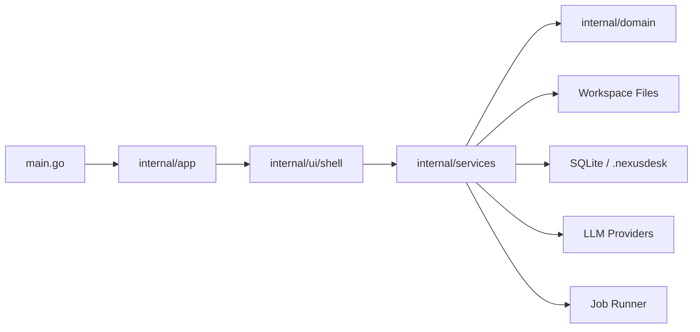

# Fyne Migration Plan

Nexus Augentic Studio is moving from Wails/React to a Fyne-native Go desktop application. This is a deliberate breaking change.

## Why This Makes Sense

The product is aiming at an IDE/data/document/operations studio, not a web dashboard wrapped in a desktop window. Wails got us a fast prototype, but the repeated gray/blank-window issues, generated binding churn, webview lifecycle concerns, and growing React shell complexity are now working against the architecture we want.

Fyne gives us:

- one Go application instead of Go plus React plus Wails bindings;
- native windows, menus, dialogs, shortcuts, and app lifecycle;
- simpler service boundaries because UI can call Go services directly;
- fewer moving parts for local-first security, approvals, jobs, and filesystem access;
- a cleaner path to package the app as a native desktop tool.

The tradeoff is real: we lose React/Monaco and must rebuild dense IDE UI patterns with native widgets or selected embedded components later. That is acceptable if we treat the Wails app as the reference implementation, not as code we must copy line-for-line.

## Repository Layout

```text
app-wails/                    Existing Wails/React implementation, preserved as reference
nexus-app/                    New Fyne-native application
nexus-app/main.go             Entrypoint only
nexus-app/go.mod              Fyne app module
nexus-app/internal/app/       Application lifecycle and windows
nexus-app/internal/domain/    Framework-free domain models
nexus-app/internal/services/  Workspace, Git, LLM, artifacts, metadata, task, and job services
nexus-app/internal/ui/        Fyne views, layouts, widgets, theme
docs/                         Product and architecture docs
tracker.md                    Fyne migration tracker
```

## Migration Strategy

1. Preserve `app-wails` exactly as the current behavior source.
2. Build `nexus-app` as a new app with a thin root and strongly grouped `internal/` packages.
3. Port stable backend services by capability: workspace, file preview, safe writes, Git, LLM, artifacts, data, jobs.
4. Rebuild UI natively, using the old UI only for workflow reference.
5. Keep folder open cheap and bounded. Expensive indexing, OCR, connector pulls, dump imports, and long agent work must become jobs.
6. Retire Wails only after native parity is good enough for day-to-day use.

## First Native Architecture



Rules:

- `internal/domain` imports no UI packages.
- `internal/services` imports domain and infrastructure, not Fyne widgets.
- `internal/ui` imports Fyne plus services.
- Root keeps only `main.go`, `go.mod`, `go.sum`, and high-level project docs.

## Immediate Risks

- Fyne desktop builds need CGO and a C compiler on Windows.
- Monaco-grade editor behavior will need either careful native implementation, an embedded editor strategy, or a deliberately simpler first editor.
- Some visual polish from the React UI will need to be rebuilt with custom Fyne widgets.
- Wails generated bindings disappear, so frontend smoke tests must be replaced with Go service/UI tests and native visual checks.

## Current Baseline

The latest reviewed `nexus-app` baseline includes the original shell slice plus substantial native parity. See `docs/12_PROJECT_REVIEW.md` for the dated review, `docs/13_PRODUCTION_READINESS.md` for release gates, `docs/15_WAILS_FEATURE_INVENTORY.md` for explicit Wails retirement blockers, and `docs/17_END_TO_END_PRODUCTION_PLAN.md` for the combined production plan, Claude findings integration, and JetBrains-like UI target.

Current estimate:

- Fyne-native migration: roughly 98% complete by useful Wails-era functionality.
- Wails useful-code parity: roughly 97% complete.
- Native Parity Beta readiness: roughly 96% complete.
- Overall production readiness: roughly 93% complete.
- Distribution and packaging readiness: roughly 70-75% complete.

Current implemented areas include:

- native app lifecycle;
- branded dark theme foundation;
- embedded approved app icon and horizontal logo from `docs/brand/`;
- native main menu with File, Edit, View, Navigate, Tools, and Help groups;
- shortcut registry for open workspace, refresh, close tab, tab navigation, and settings;
- Workbench-style shell with rail, toolbar, navigator, editor tabs, assistant panel, and bottom tabs;
- shell UI split into focused files for panels, tabs, workspace actions, activity, tree, and preview;
- native folder-open dialog;
- lazy bounded workspace listing service with traversal protection, ignored folder handling, symlink skip, and entry caps;
- first rooted read-only file preview for capped UTF-8, UTF-16, and Windows-1251 text plus binary metadata;
- first editor tab lifecycle with same-file tab reuse and close cleanup;
- UI-independent editor tab session model with active tab, dirty state, pinned state, reuse, and close guards;
- native editor chrome for pinned tabs, dirty indicators, and state-driven tab labels/icons;
- first native draft-only text editor with Source/Preview tabs, automatic dirty tracking, disabled Save, and local draft revert;
- Markdown editor previews render Markdown in the Preview tab while non-Markdown text files stay in read-only source preview mode;
- first native image preview path for capped workspace image files using service-returned bytes and Fyne image rendering;
- first native capped CSV/TSV table preview path with service-side parsing and UI-side table rendering;
- first native DOCX text preview path using bounded service-side extraction from `word/document.xml`;
- first native PDF text preview path using bounded service-side literal text extraction and a read-only Fyne text surface;
- first native text/code safe write service with rooted diff previews, append/apply flows, encoding-aware writes, and rollback snapshots under `.nexusdesk/rollbacks`;
- draft editor Save wiring that applies through the native safe write service, marks the editor tab clean, and leaves a rollback record;
- first native file create, delete, copy, move, and rename services with rooted validation, metadata guards, operation previews, and rollback records;
- first native workspace search service and bottom result panel for bounded path/content search with preview-tab opening;
- first native Problems service and bottom panel for bounded TODO/FIXME/HACK/BUG, merge-conflict, and invalid JSON scanning;
- first native Git status service and manual bottom Git refresh panel with hidden Windows command execution;
- directory-grouped changed-file rendering in the native Git panel;
- first native read-only selected-file Git diff service with hunk-windowed unified previews plus unified, split, and diff-only panel modes;
- first native parsed diff hunk metadata and previous/next hunk selection in the Git panel;
- first native confirmed file-level Git stage and unstage controls through the Git service boundary;
- first native confirmed hunk-level Git stage/unstage controls through index-only `git apply` patches;
- first native rollback browser panel for safe-write and file-operation records with confirmation before apply;
- first native workspace-tree action strip for create, copy, rename/move, and delete through the file-operation services;
- first native non-secret settings store and provider/model settings page skeleton;
- first native OpenAI-compatible/Ollama LLM client with chat, streaming chat, provider probing, Ollama runtime diagnostics, context-window options, response reserve, and workspace-context quoting;
- first native assistant orchestration service and assistant panel streaming path with selected-file context from previewable text, document, PDF, and table files;
- first native agent runtime service with ReAct action parsing, built-in plan updates, injected tool execution, event emission, backend loop guard, bounded observations, and unverified mutation-claim warnings;
- first native Agent mode in the assistant panel with compact live activity tail and final-answer replacement;
- first native deterministic tool dispatcher with descriptors for context packs, file previews, workspace search, Problems, Git status/diff, task listing, rollback listing, approval-gated rollback application, and approval-gated task execution;
- first native approval service and bottom Approvals tab with append-only records plus time-limited full-project access policy;
- first native workspace context-pack builder for files, directories, and the workspace root with ignored-folder skips, file/depth/entry/byte caps, preview-safe text extraction, and assistant integration;
- first native task discovery and safe task-run service for npm scripts, Go tests, Python pytest, Cargo tests, and Docker Compose config checks;
- first native bottom Tasks tab for discovery, confirmed task runs, and read-only last-run stdout/stderr;
- first native in-memory Jobs service and Jobs tab for task-run status, log tail, and cancellation requests;
- first native SQLite metadata store under `.nexusdesk/metadata` with schema/manifest creation, persisted jobs, and persisted task-run records;
- first native task-run Markdown report artifacts under `.nexusdesk/artifacts/task-runs` linked from persisted task-run records;
- native workspace file create/folder create/copy/move/rename/delete actions with rollback records and tree-row context menus;
- native editor dirty close confirmations, pinned ordering, safe save, and rollback-backed writes;
- native Search, Problems, Git, Tasks, Jobs, Operations, Data, History, Agent Audit, Artifacts, Rollbacks, Approvals, and Settings panels;
- native data profiling/query/SQL/notebooks/charts for CSV, TSV, JSON, NDJSON, XLSX, logs, Parquet metadata, and workspace SQLite;
- native read-only external database profile flows for PostgreSQL, MySQL/MariaDB, SQL Server, SQLite, and DuckDB guarded builds;
- native artifact browsing, metadata search, archive/delete/restore, comparison, source freshness, document extraction, operations runbooks, and notebook/SQLite/chart/dashboard artifacts;
- native presentation-outline artifact generation and regeneration from supported report-like artifacts;
- native Ask/Agent modes with LLM streaming, deterministic tool dispatch, approval-gated safe mutations, compact activity tail, and persisted audit records;
- framework-free workspace domain model.

Remaining migration blockers:

- Native editor beta replacement decision is documented in `docs/16_EDITOR_PARITY_STRATEGY.md`; editable-widget inline syntax styling is now a post-beta enhancement.
- Future LSP/deeper cross-file language action strategy.
- Deeper assistant retrieval/ranking quality beyond current deterministic source/citation/evidence/coverage diagnostics.
- Richer generated document/deck template variants and cross-suite compatibility smoke beyond current native export baselines.
- JetBrains-like native UI polish around tool windows, settings, assistant, data grids, diagnostics, onboarding, and workflow hierarchy.
- Platform packaging/runtime validation for macOS Keychain and Linux Secret Service/libsecret support.
- Apply the shared durable slow-workflow contract to OCR, dump imports, connector pulls, long indexing, long report generation, packaged exports, and long agent runs as those workflows are implemented.

Full execution now works on the current workstation when the MSYS2 UCRT64 compiler path is configured. `nexus-app/scripts/dev-env.ps1` prepends `C:\msys64\ucrt64\bin` and `C:\msys64\usr\bin`, sets `CGO_ENABLED=1`, can run tests, builds, or the desktop app, and calls `build-windows-icon.ps1` during Windows builds so `build\nexusdesk.exe` has the approved executable icon resource. `CGO_ENABLED=0 go build .` still fails because Fyne's OpenGL binding requires CGO-backed files.

Current verification:

```powershell
cd nexus-app
.\scripts\dev-env.ps1 -Test
```

Native app build/run:

```powershell
cd nexus-app
.\scripts\dev-env.ps1 -Build
.\scripts\dev-env.ps1 -Run
```

## Contributor-Grade Structure

The new app should be easy for outside contributors to navigate:

- one package should have one reason to change;
- UI code should be split by panel/dialog/widget, not accumulated in one shell file;
- service packages should expose small use-case methods and keep file/path/database/LLM safety inside services;
- every major package should get tests before it becomes a dependency of agent or UI workflows;
- long files are a smell. Split by responsibility before adding a second unrelated workflow to the same file.

Planned feature parity is preserved in `tracker.md` under the long-term functionality backlog.
